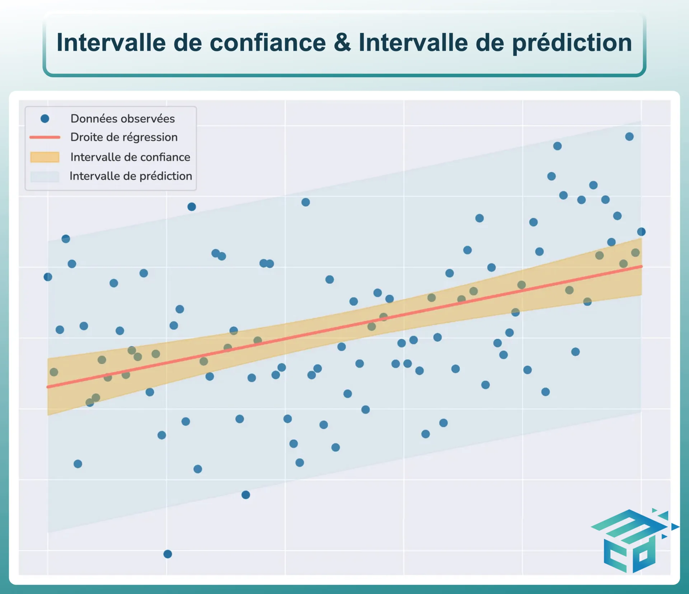
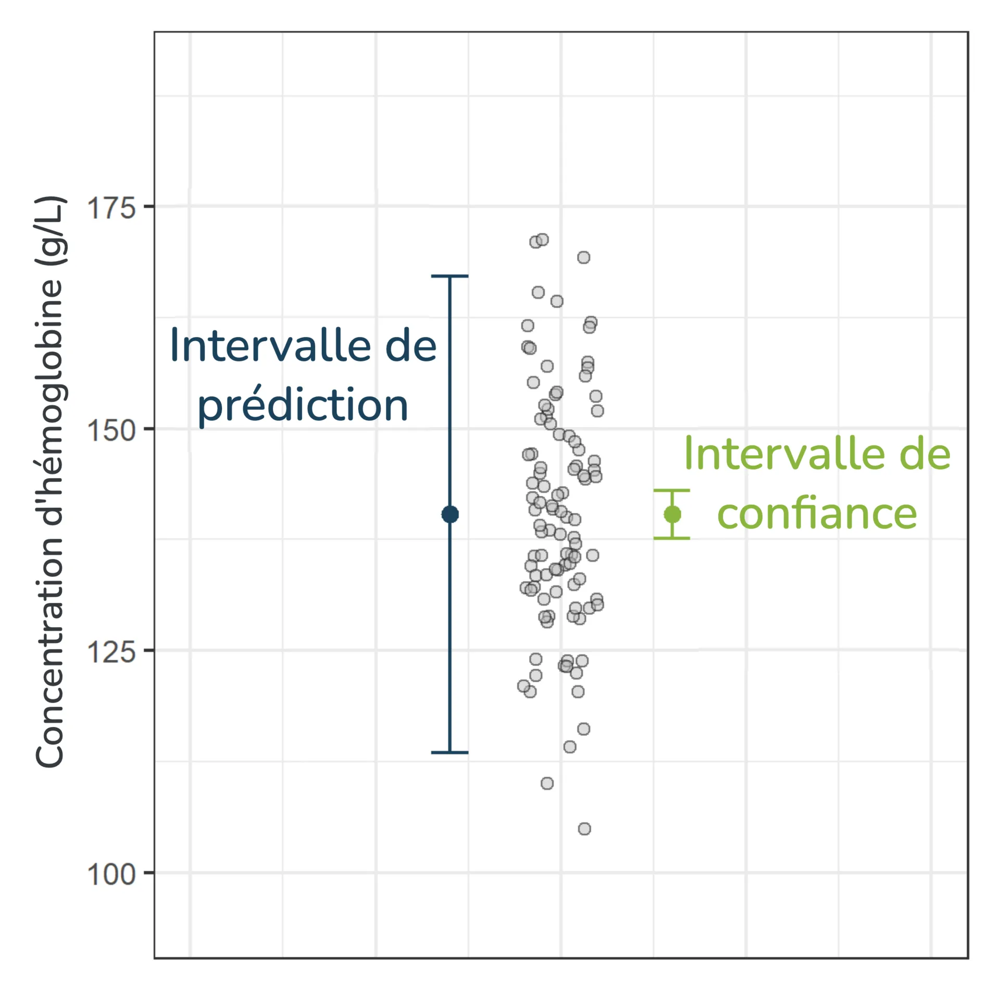

### Régression linéaire simple

Modélise la relation linéaire entre $Y$ et $X$: 

- 1 variable dépendante $Y$ (target)
- 1 variable indépendante $X$
$$Y = aX + b$$

### Régression linéaire multiple

Modélise la relation linéaire entre $Y$ et plusieurs variables explicatives :
- 1 variable dépendante $Y$
- plusieurs variables indépendantes ou explicative ($X_1,X_2,...,X_n$)
chacune ayant son propre coefficient $(a_1, a_2,..., a_n)$
le terme $b$ est l’ordonnée à l’origine (constante ou intercept).
$$Y = a_1X_1 + a_2X_2 +…+anXn+b$$

### Autres RL

- **RL simple = modèle en ligne droite**.
- **RL polynomiale = modèle en courbe ou ligne sinueuse**.
- **RL multiple = modèle linéaire (multidimensionnel)**
   une droite dans l’espace à plus de deux dimensions), mais la relation entre $Y$ et chaque $X_i$ reste linéaire

| Terme                        | Variables indépendantes | Variables dépendantes | Exemple typique                                                  |
| ---------------------------- | ----------------------- | --------------------- | ---------------------------------------------------------------- |
| Régression polynomiale       | 1 (x, x², x³, ...)      | 1                     | Prédire y à partir de x, x², x³                                  |
| Régression linéaire simple   | 1                       | 1                     | Prédire y à partir de x                                          |
| Régression linéaire multiple | Plusieurs               | 1                     | Prédire y à partir de x₁, x₂, x₃                                 |
| Régression multivariable     | Plusieurs               | 1                     | Synonyme de linéaire multiple (plusieurs variables explicatives) |
| Régression multivariée       | 1 ou plusieurs          | Plusieurs             | Prédire plusieurs y (ex : y₁, y₂) à partir de x₁, x₂, x₃         |
## Exemple de RL

**Objectif :** Trouver une relation mathématique entre les ventes $Y$ et deux variables explicatives :
- $X_1$  prix du produit en euros  
- $X_2$  budget publicitaire  

**Hypothèse :** Relation linéaire
$$
\hat{Y} = a_1X_1 + a_2X_2 + b
$$

| Symbole              | Signification                                                                           |
| -------------------- | --------------------------------------------------------------------------------------- |
| $\hat{Y}$            | ($Y$ chapeau) valeurs prédites de $Y$                                                   |
|   $a_1$ et  $a_2$ | coefficients associés à $X_1$ et $X_2$  mesurant l'impact de chaque variable sur $Y$ |
| $b$                  | l'ordonnée à l'origine la valeur de $Y$ lorsque $X_1$ et $X_2$ valent zéro           |
| $X_1$                | toute la colonne des prix                                                               |
| $X_2$                | toute la colonne des budget publicitaire                                                |
| $x_{ij}$             | la ligne $j$ de la colonne $X_i$                                                        |

Les valeurs prédites forment un ensemble $\hat{Y_1}, \hat{Y_2}, \dots, \hat{Y_n}$ qui correspondent aux prédictions faites pour chaque observation.

### Erreur des moindres carrés MSE

Minimiser l'erreur quadratique moyenne (Mean Square Error - MSE) :

$$
MSE = \frac{1}{n} \sum_{i=1}^{n} (y_i - \hat{y})^2
$$

Formule matricielle :

$$
\begin{bmatrix}
    b \\
    a_1 \\
    a_2
\end{bmatrix} = (X^t X)^{-1} X^t Y
$$

### Exemple de Résultat

$$
\hat{Y} = -5X_1 + 2X_2 + 50
$$

**Interprétation** :  
- $X_1$ : une augmentation de 1 euro du prix réduit les ventes de 5 unités  
- $X_2$ : une augmentation de 1 euro du budget publicitaire augmente les ventes de 2 unités  

### Prédiction

- **Prix** : 200 euros  
- **Budget publicitaire** : 350 euros  

Calcul :

$$
\hat{Y} = -5(200) + 2(350) + 50 = -250
$$

### Incertitude
la régression linéaire ne prédit JAMAIS une valeur exacte.

En réalité, elle modélise la relation entre une variable d'entrée et la valeur moyenne de la variable de sortie.

- **L'intervalle de confiance** capture l'incertitude autour de la moyenne du résultat.

- **L'intervalle de prédiction** capture l'incertitude autour d'une valeur individuelle du résultat.

#### Intervalle de confiance
Il indique la plage dans laquelle se situe la moyenne de la variable de sortie pour une entrée donnée.

Ainsi, un intervalle de confiance à 95 % signifie que :

Pour une entrée donnée, nous sommes confiants à 95 % que la moyenne réelle se trouvera dans cette région.

#### Intervalle de prédiction
Indique la plage de valeurs possibles qu'une observation individuelle de la variable de sortie peut prendre.

Il répond à la question : "Si nous connaissons la valeur d'entrée, quelle est la plage de valeurs que nous pourrions observer concrètement ?"

Par exemple, un intervalle de prédiction à 95 % nous dit que :

Pour une entrée donnée, 95 % des valeurs observées se situeront dans cette région.