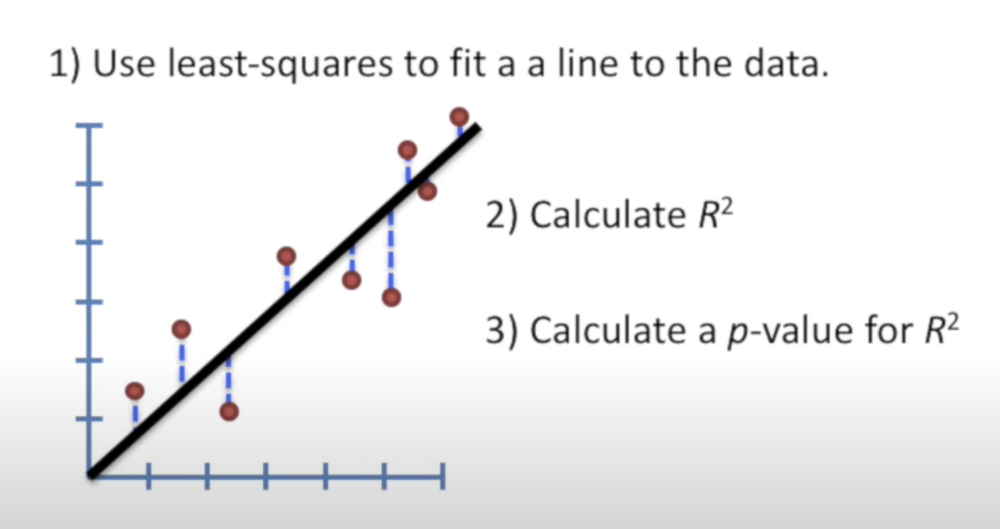
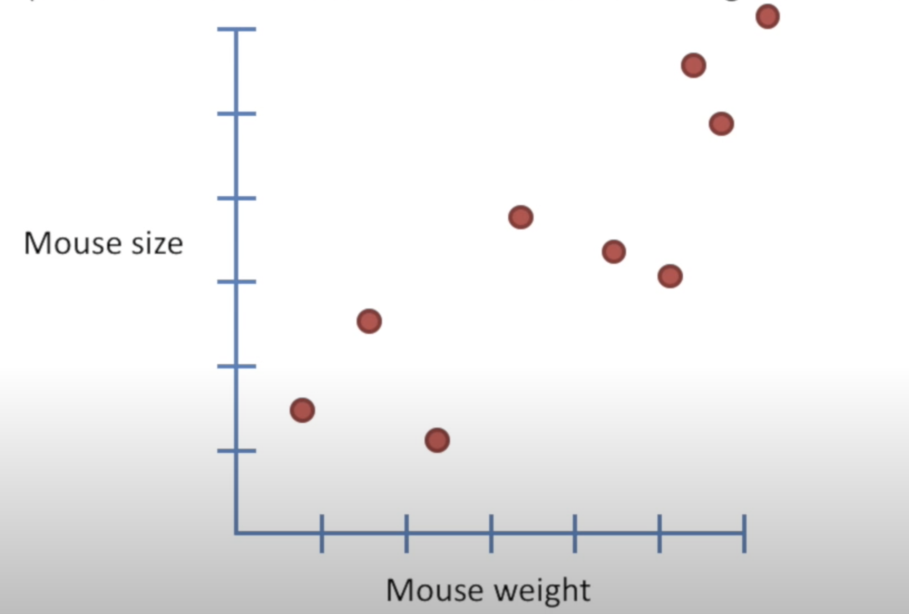
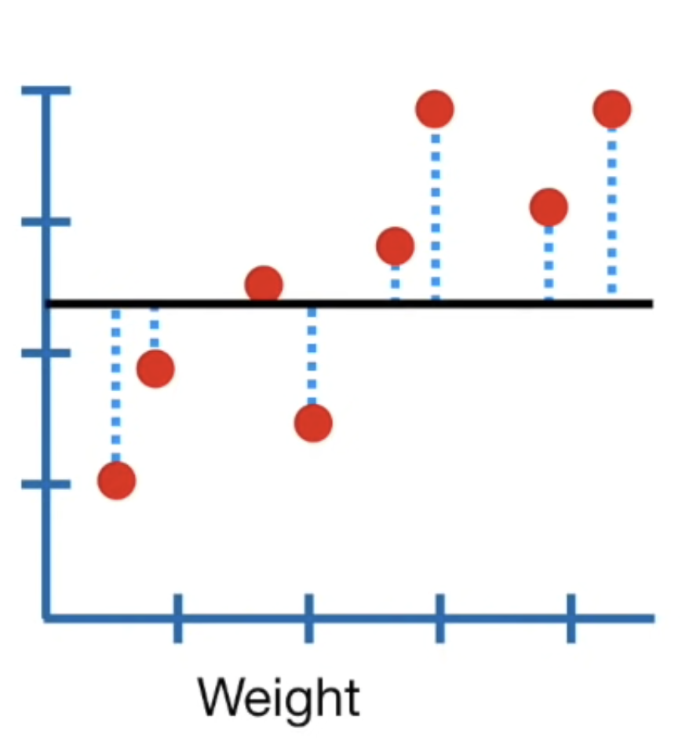
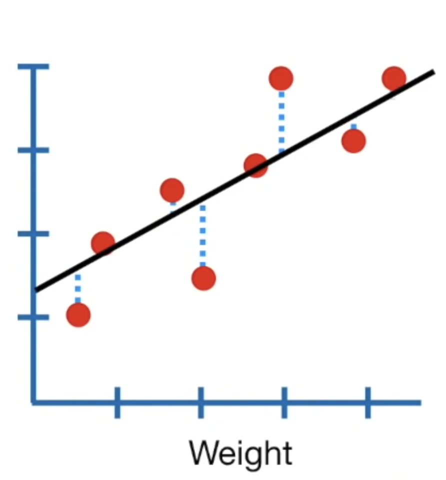
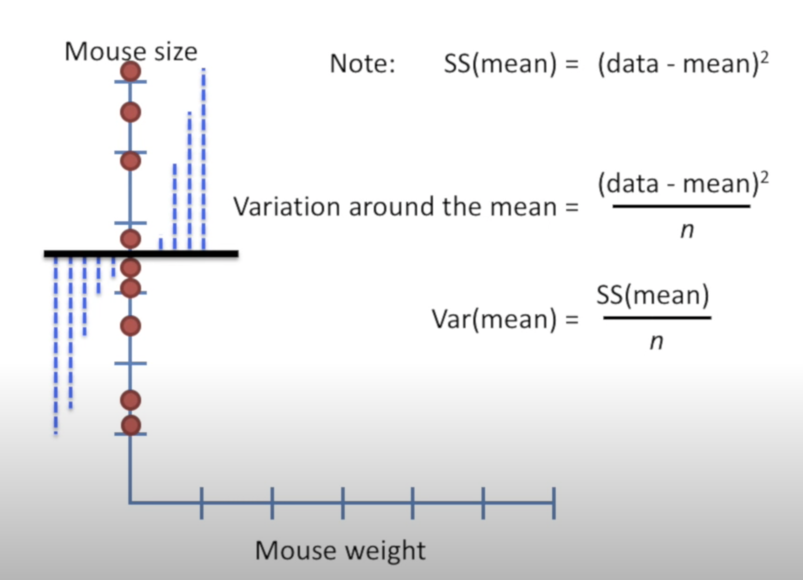

[source statquest](https://www.youtube.com/watch?v=nk2CQITm_eo&t=281s)

[Machine Learning avec sickit Learn, Aurélien Géron, ed. Dunod](https://github.com/ageron/handson-ml2)

## Least Sum of Squared Errors - moindre erreur quadratique

Soit un ensemble de points  

**résiduel** = somme des carrés des distances entre les points et la droite (erreurs)
= Sum of Squares = SS
1. On trace une ligne au hazard et on calcule le **résiduel** entre les points et la ligne

2. On pivote légèrement la ligne, on recalcule les résiduels. Bis repetita

3. En comparant le résultat des différentes lignes, on cherche celle qui minimise : 
    - la somme des carrés des erreurs (SSE)
    - ou Residual Sum of Squares (RSS)
    - ou moindre erreur quadratique
    - ou least squares error

Cette droite minimise l’écart global entre les prédictions et les vraies valeurs

 

La ligne obtenue à 2 paramètres :
- valeur à l'intersection de l'axe y `intercept`
- pente `slope`

Si la pente est différente de 0, la valeur $x$ contribue à prédire la variable $y$

## Coefficient de détermination $R^2$
Permet d’évaluer la qualité de la prédiction du modèle linéaire 
**mesure la part de la variance expliquée par le modèle**

|Sum of Square mean|Sum of Square fit|$R^2$|
|-|-|-|
|||$$R^2=\frac{SS(mean)-SS(fit)}{SS(mean)}$$|
|Résidus par rapport à $Y$ = la moyenne |Résidus par rapport à la droite de régression|% de variation autour de la moyenne réduit par l'ajustement|

