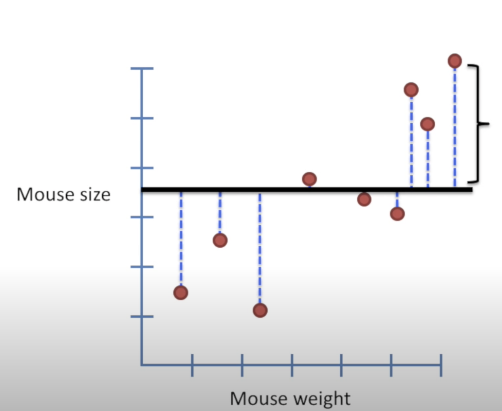

[source statquest](https://www.youtube.com/watch?v=nk2CQITm_eo&t=281s)

[Machine Learning avec sickit Learn, Aurélien Géron, ed. Dunod](https://github.com/ageron/handson-ml2)

## Least-squares

Soit un ensemble de points :

1. On trace une ligne

| 2. Calcul des résiduels    (résiduels = somme des carrés des distances) | 3. On pivote légèrement la ligne     |
| ---------------------------------------------------------------------------------------------------------------------------------------------------- | ------------------------------------------------------------------------------------------------ |
4. On refait les calculs, et bis repetita
5. On compare le résultat des différentes lignes
6. Pour trouver celle qui correspond au "least square"

La ligne obtenue à 2 paramètres :
- valeur à l'intersection de l'axe y
- pente

Si la pente est différente de 0, la valeur en x peut aider à prédire la valeur en y

## $R^2$
Le calcul du $R^2$ permet de déterminer la valeur de la prédiction

1. Trouver la moyenne sur l'axe Y
2. calculer les  résiduels ( distance par rapport à la moyenne )

