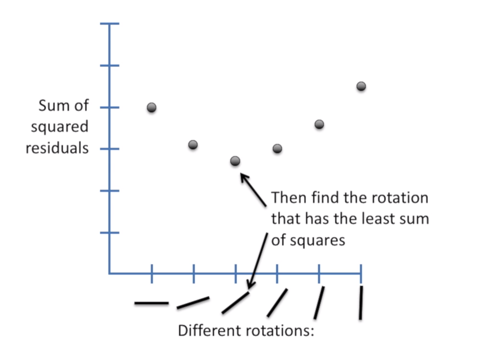

[source statquest](https://www.youtube.com/watch?v=nk2CQITm_eo&t=281s)

[Machine Learning avec sickit Learn, Aurélien Géron, ed. Dunod](https://github.com/ageron/handson-ml2)

## Least-squares

Soit un ensemble de points :

1. On trace une ligne au hazard et on calcul le **résiduel** entre les points et la ligne (résiduel = somme des carrés des distances)

2. On pivote légèrement la ligne, on refait le calcul, et bis repetita

3. En comparant le résultat des différentes lignes, on trouve celle qui correspond au "least square error" la moindre erreur quadratique

 

La ligne obtenue à 2 paramètres :
- valeur à l'intersection de l'axe y `intercept`
- pente `slope`

Si la pente est différente de 0, la valeur en x peut aider à prédire la valeur en y

## $R^2$
Le calcul du $R^2$ permet de déterminer la valeur de la prédiction

1. Trouver la moyenne sur l'axe Y
2. calculer les  résiduels ( distance par rapport à la moyenne )

