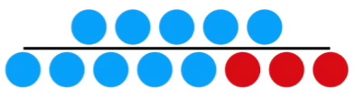
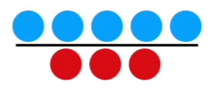
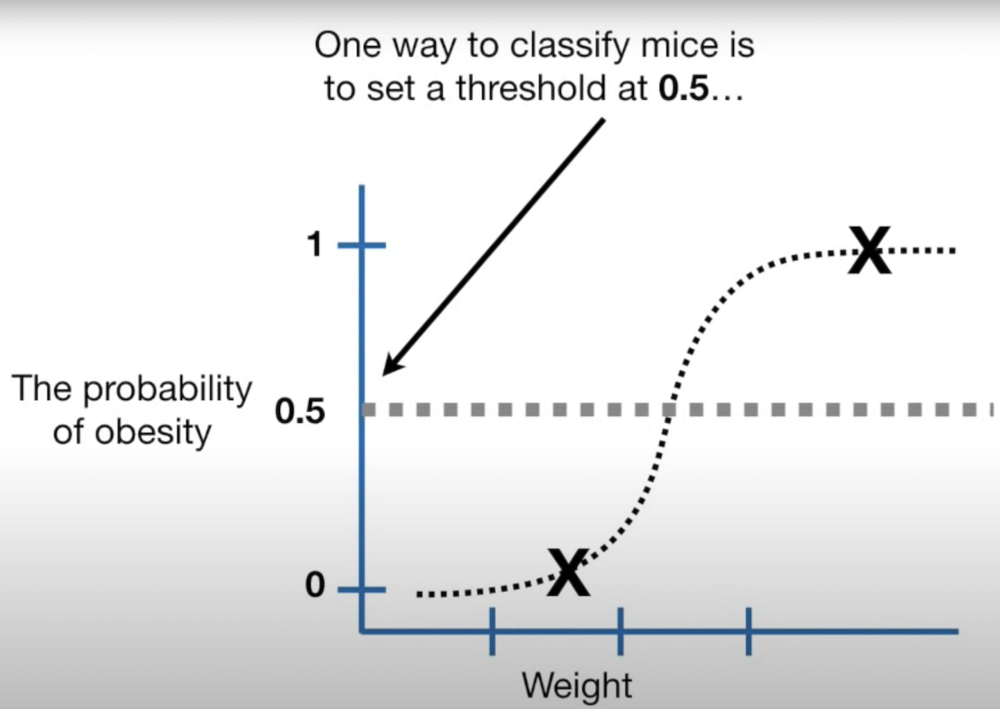
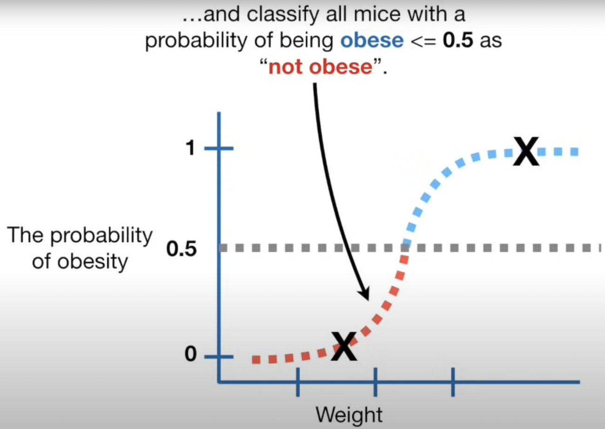
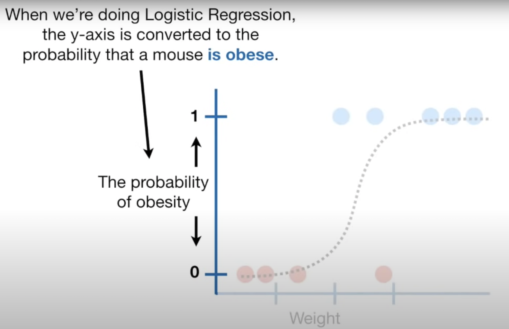
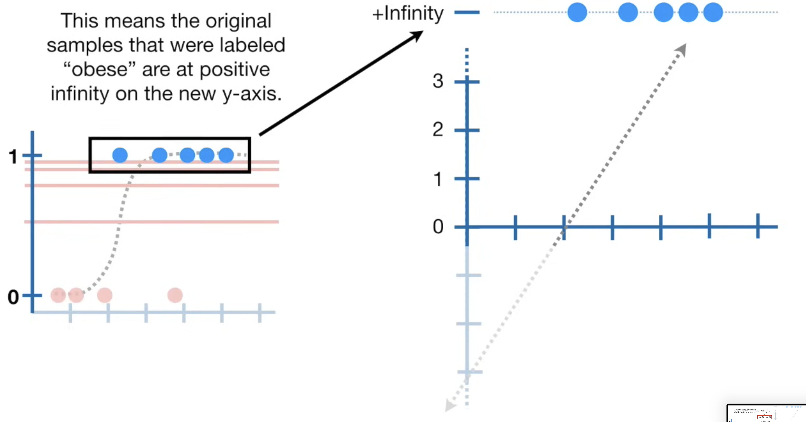
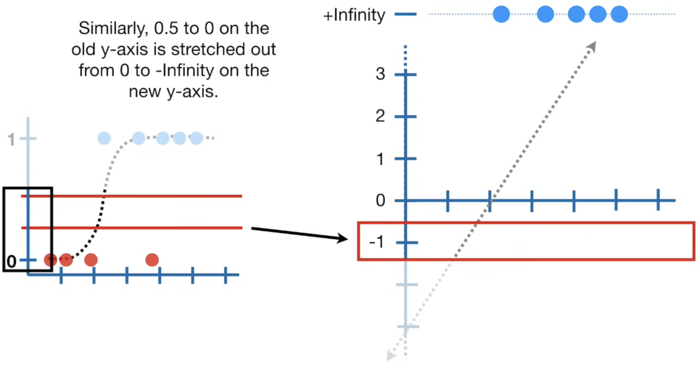
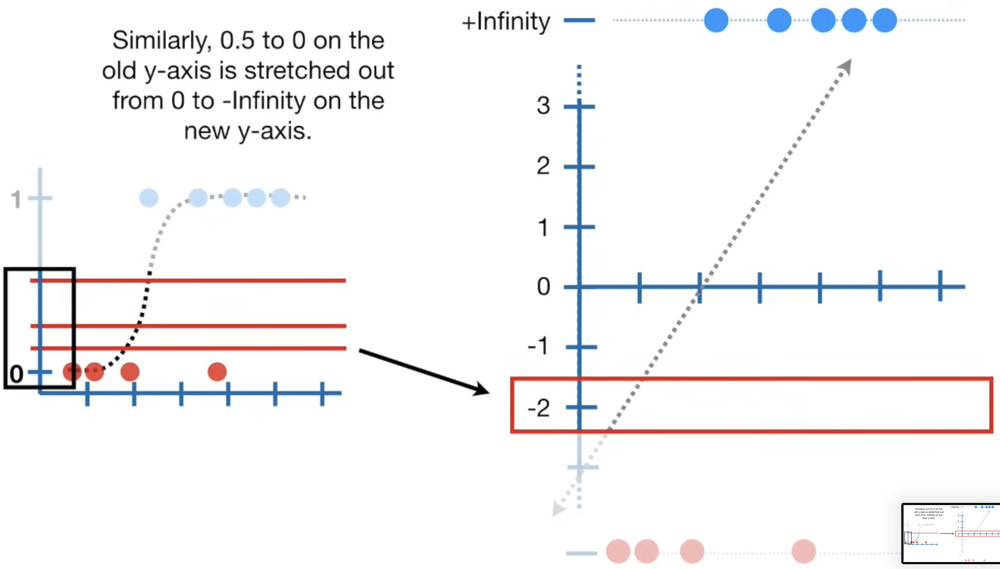
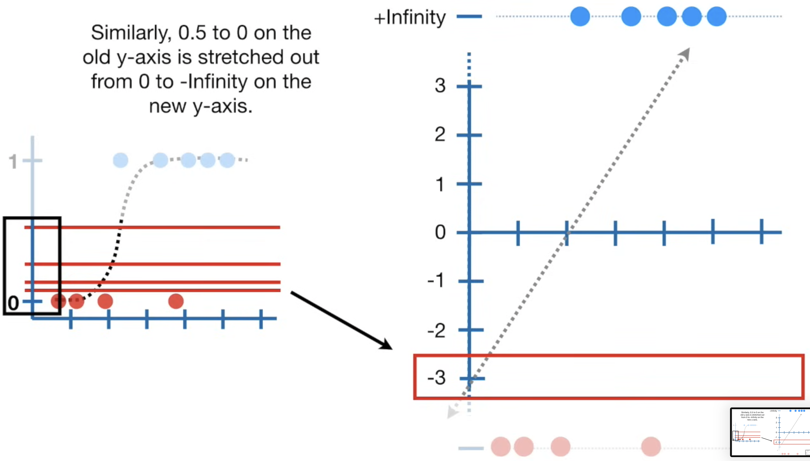

La regression logistique et la regression linéaire font partie des Generalized Linear Model GLM

prédit des valeurs de probabilité comprises entre 0 et 1

#### probabilité
Mesure la chance qu’un événement se produise
exprimée sur une échelle de 0 à 1
ratio d'un événement par l'ensemble des issues  possibles
$\frac{\text{mon équipe gagne}} {\text{mon équipe gagne + mon équipe perd}}$ 

#### odds (ou cotes)
ratio entre la probabilité qu’un événement se produise et la probabilité qu’il ne se produise pas :
$\frac{\text{mon équipe gagne}} {\text{mon équipe perd}}$ 

**Si la probabilité d’un événement est $𝑝$** alors :$$\text{odd}=\frac{𝑝}{1-p}
$$

Et inversement 
$$p=\frac{odds}{1+odds}$$
​
 .
une probabilité de 0,75 correspond à des odds de 3 (car 0,75/0,25=3)

On **transforme l'axe y** de **probabilité de  0 à 1** en **log(odds)** : $$\log\left(\frac{p}{1 - p}\right)$$
(forme classique du _logit_ en statistiques)

<!-- <table>
    <tr>
        <td></td>
        <td></td>
    </tr>
    <tr>
 <td></td>
 <td></td>
</tr>
</table> -->

  
  

 

  
  

 

---
$$log(1)=0$$

---  

$$\log(0) = -\infty$$      si on s'approche de 0 par des valeurs positives :  
$\lim_{x \to 0^+} \log(x) = -\infty$  

---

Pour faire simple :
$log(\frac{1}{0}​)=log(1)−log(0)$

$\log\left(\frac{1}{0}\right) = 0 - (-\infty) = +\infty$  

ou plus exactement :  
$$\lim_{x \to 0^+} \log\left(\frac{1}{x}\right) = +\infty$$

---

|  |  |
| ------------------------------------------------------------ | ------------------------------------------------------------ |
|  |  |
|  |  |
|  |  |
