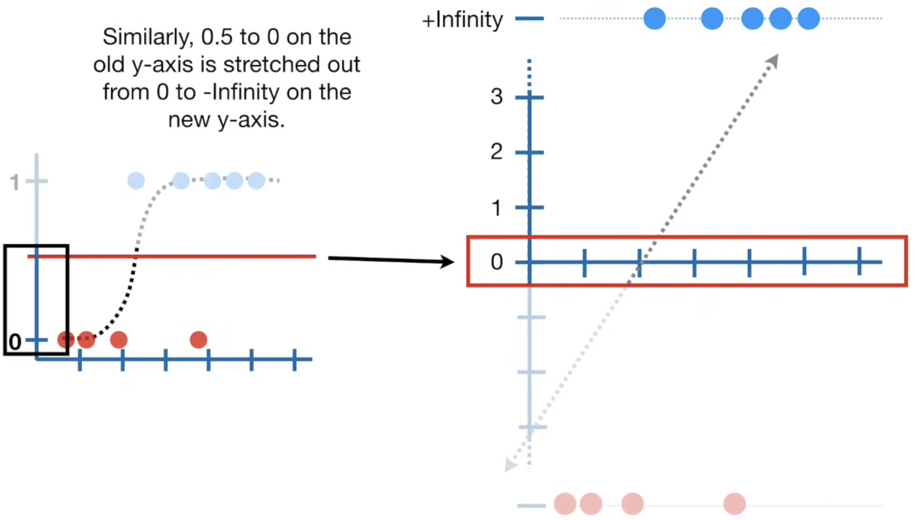

La regression logistique et la regression linéaire font partie des Generalized Linear Model GLM

prédit des valeurs de probabilité comprises entre 0 et 1

On transforme l'axe y de probabilité de  0 à 1 en log(probabilite) : $\log\left(\frac{p}{1 - p}\right)$
(forme classique du _logit_ en statistiques)

|   |  |
| ------------------------------------------------------------ | ------------------------------------------------------------- |
|  |   |

$log(1)=0$   
$\log(0) = -\infty$      si on s'approche de 0 par des valeurs positives :  $\lim_{x \to 0^+} \log(x) = -\infty$  

Pour faire simple :
$log(\frac{1}{0}​)=log(1)−log(0)$

$\log\left(\frac{1}{0}\right) = 0 - (-\infty) = +\infty$  

ou plus exactement :  
$$\lim_{x \to 0^+} \log\left(\frac{1}{x}\right) = +\infty$$

|  |  |
| ------------------------------------------------------------ | ------------------------------------------------------------ |
|  |  |
|  |  |
|  |  |
