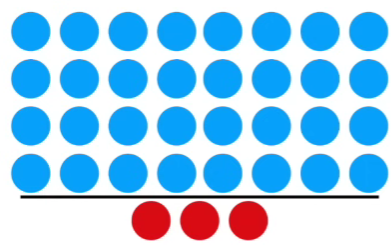
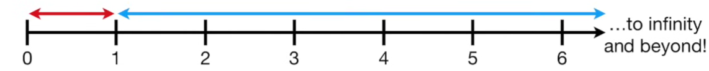

La régression logistique est un cas particulier de la famille des Generalized Linear Models (GLM), utilisée lorsque la variable cible est binaire.

#### odds (ou cotes)
ratio entre la **probabilité qu’un événement se produise** / **probabilité qu’il ne se produise pas** :
|odds/cote|calcul par comptage|
|-|-|
|$\frac{\text{mon équipe gagne}} {\text{mon équipe perd}}$| 5/3 = 1,7|

#### probabilité
Mesure la chance qu’un événement se produise, sur une échelle **de 0 à 1**
ratio d'un **événement** / **ensemble des issues  possibles**
|probabilité|calcul par comptage||
|-|-|-|
|$\frac{\text{mon équipe gagne}} {\text{mon équipe gagne + mon équipe perd}}$| 5/8 = 0.625|1 - probabilité (inverse)|
|$\frac{\text{mon équipe perd}} {\text{mon équipe gagne + mon équipe perd}}$| 3/8 = 0.375|1 - probabilité (inverse)|

**Si la probabilité d’un événement est $𝑝$** 
p = probabilité de gagner
alors :
|odds|calcul par probabilité|
|-|-|
|$$\text{odds}=\frac{𝑝}{1-p}$$|$$\frac{\frac{5}{8}}{1 - \frac{5}{8}}= \frac{\frac{5}{8}}{\frac{3}{8}}=\frac{5}{3}=1.7$$|

Et inversement, la probabilité : 
$$p=\frac{odds}{1+odds}$$ 
 ​
une probabilité de 0,75 correspond à des odds de 3 (car 0,75/0,25=3) : 

$$p = 0{,}75$$

$$1 - p = 0{,}25$$

$$\text{odds} = \frac{p}{1 - p}
= \frac{0{,}75}{0{,}25}
= 3$$

### logit : log (odds)
#### Probleme
Les **odds** sont asymétriques

|odds|| | |plage|
|-|-|-|-|-|
|très favorable||32/3|10.7|entre 1 et $+\infty$|
|favorable||8/3|2.66|entre 1 et $+\infty$|
|défavorable||1/4|0.25|entre 1 et 0|
|très défavorable||1/32|0.031|entre 1 et 0|

À valeur de probabilité égale mais opposée, la valeur des petits odds est compressée comparée aux grands odds : 
1/6 = **0.17** 
6/1 = **6** 

#### Solution

On transforme l’axe des probabilités pour pouvoir utiliser un modèle linéaire : 
Du domaine [0, 1] vers (−∞, +∞) grâce au logit : 
$\text{logit}(p) = \log\left(\frac{p}{1-p}\right)$

Puis, lors de la prédiction, on revient de (−∞, +∞) vers [0, 1] 
grâce à la fonction sigmoïde (inverse du logit) : 
$\sigma(z) = \frac{1}{1 + e^{-z}}$

Logarithme naturel = logarithme népérien, c’est-à-dire en base e (avec $e≈2.718$)

|logit (forme classique statistiques)|fonction sigmoïde (inverse)|
|-|-|
|transforme une sismoïde en droite|transforme une droite en sigmoïde fonction d'activation de la regression logisitique|
|étire l'axe y de 0 à 1 vers ($-\infty$, $+\infty$)|restreint l'axe y à l'intervalle [0, 1] selon la proximité avec la frontière de décision|
||prend une valeur réelle et retourne une probabilité|
|$$\text{logit(p)}=\log\left( \frac{p}{1 - p} \right)$$|$$\text{p}=\frac{e^\text{log(odds)}}{1 + e^\text{log(odds)}}=\frac{1}{1+e^{-z}}$$|

Cela revient à centrer sur 0 et normaliser:
|$\text{Probabilité p}$|$\text{logit(p)}$|Prediction|
|-|-|-|
|de 0.5 à 1|de 0 à $+\infty$|classe 1|
|de 0 à 0.5|de $-\infty$ à 0|classe 0|

  
  

 

---
|||
|-|-|
|$log(1)=0$|$\log(0) = -\infty$|
||si on s'approche de 0 par des valeurs positives :   $\lim_{x \to 0^+} \log(x) = -\infty$| 

Pour faire simple :
$log(\frac{1}{0^+}​)=log(1)−log(0)$

$\log\left(\frac{1}{0^+}\right) = 0 - (-\infty) = +\infty$  

ou plus exactement :  
$$\lim_{x \to 0^+} \log\left(\frac{1}{x}\right) = +\infty$$

---

|  |  |
| ------------------------------------------------------------ | ------------------------------------------------------------ |
|  |  |
|  |  |
|  |  |
