La regression logistique et la regression linéaire font partie des Generalized Linear Model GLM

#### odds (ou cotes)
ratio entre la **probabilité qu’un événement se produise** / **probabilité qu’il ne se produise pas** :
|odds|calcul par comptage|||
|-|-|-|-|
|$\frac{\text{mon équipe gagne}} {\text{mon équipe perd}}$||5/3|1.7|

#### probabilité
Mesure la chance qu’un événement se produise, sur une échelle **de 0 à 1**
ratio d'un **événement** / **ensemble des issues  possibles**
|probabilité|calcul par comptage||||
|-|-|-|-|-|
|$\frac{\text{mon équipe gagne}} {\text{mon équipe gagne + mon équipe perd}}$||5/8|0.625|1 - p (inverse)|
|$\frac{\text{mon équipe perd}} {\text{mon équipe gagne + mon équipe perd}}$||3/8|0.375|1 - p (inverse)|

**Si la probabilité d’un événement est $𝑝$** p = probabilité de gagner
alors :
|odds|calcul par probabilité|
|-|-|
|$$\text{odds}=\frac{𝑝}{1-p}$$|$$\frac{\frac{5}{8}}{1 - \frac{5}{8}}= \frac{\frac{5}{8}}{\frac{3}{8}}=\frac{5}{3}=1.7$$|

Et inversement 
$$probabilité=\frac{odds}{1+odds}$$
​
une probabilité de 0,75 correspond à des odds de 3 (car 0,75/0,25=3)

### logit : log (odds)
#### Probleme
Les **odds** sont asymétriques

|odds|| | |plage|
|-|-|-|-|-|
|très favorable|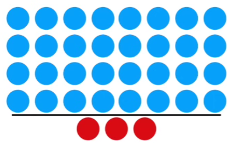|32/3|10.7|entre 1 et $+\infty$|
|favorable|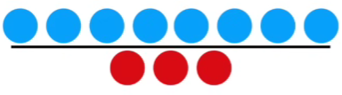|8/3|2.66| |

||| | ||
|-|-|-|-|-|
|défavorable||1/4|0.25|entre 1 et 0|
|très défavorable|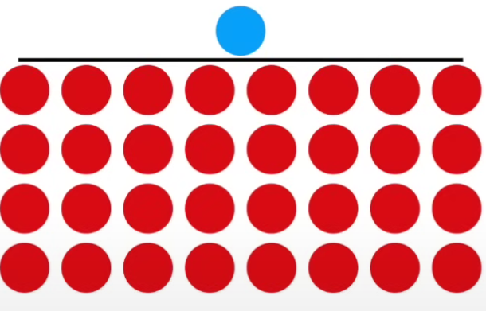|1/32|0.031||

À valeur de probabilité égale mais opposée, la valeur des petits odds est compressée comparée aux grands odds :
1/6 = **0.17**
6/1 = **6**

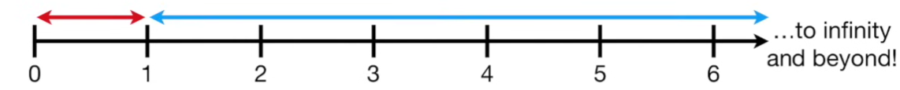

#### Solution
On **transforme l'axe y** de **probabilité de  0 à 1** en **log(odds)** : 

|logit (forme classique statistiques)|fonction sigmoïde (inverse)|
|-|-|
|transforme une sismoïde en droite|transforme une droite en sigmoïde|
|étire l'axe y de 0 à 1 vers ($-\infty$, $+\infty$)|restreint l'axe y à l'intervalle [0, 1]|
||prend une valeur réelle et retourne une probabilité|
|$$\text{logit(p)}=\log\left( \frac{p}{1 - p} \right)$$|$$\text{p}=\frac{e^\text{log(odds)}}{1 + e^\text{log(odds)}}=\frac{1}{1+e^{-z}}$$|
|logarithme naturel = logarithme népérien|c’est-à-dire en base e (avec $e≈2.718$)|

Cela revient à centrer sur 0 et normaliser:
|$\text{Probabilité p}$|$\text{logit(p)}$ |
|-|-|
|de 0.5 à 1|de 0 à $+\infty$|
|de 0 à 0.5|de $-\infty$ à 0|

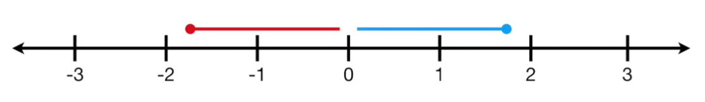

  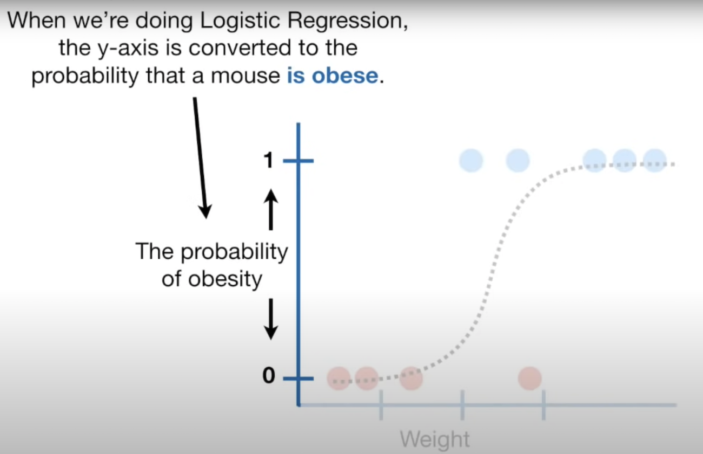
  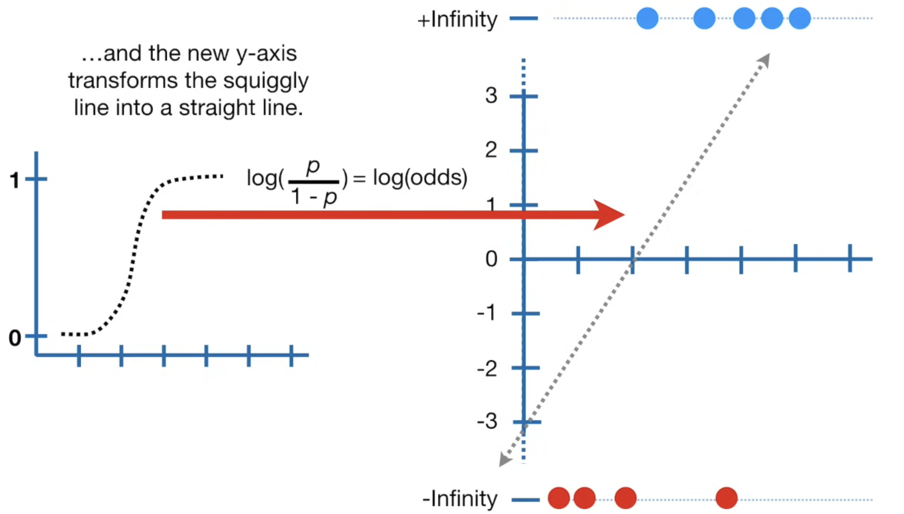

 

---
|||
|-|-|
|$log(1)=0$|$\log(0) = -\infty$|
||si on s'approche de 0 par des valeurs positives :   $\lim_{x \to 0^+} \log(x) = -\infty$| 

Pour faire simple :
$log(\frac{1}{0^+}​)=log(1)−log(0)$

$\log\left(\frac{1}{0^+}\right) = 0 - (-\infty) = +\infty$  

ou plus exactement :  
$$\lim_{x \to 0^+} \log\left(\frac{1}{x}\right) = +\infty$$

---

| 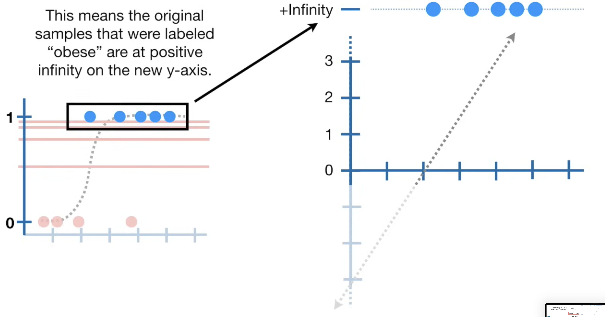 | 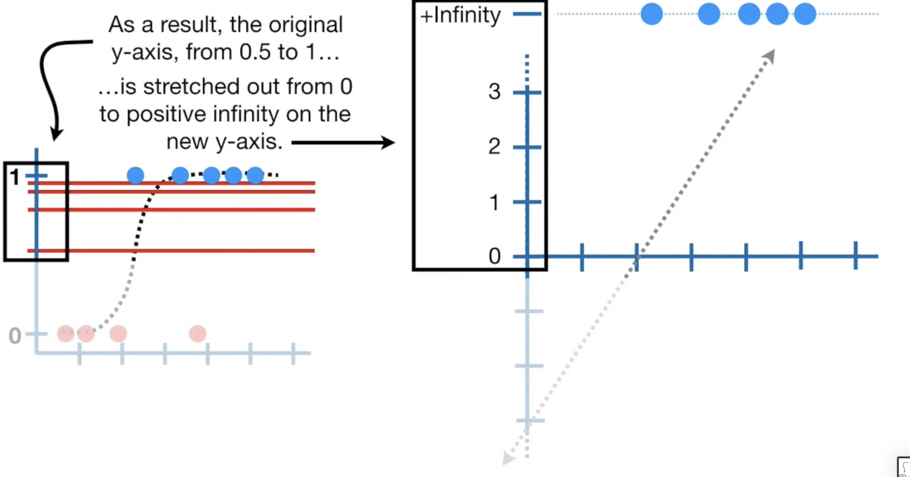 |
| ------------------------------------------------------------ | ------------------------------------------------------------ |
| 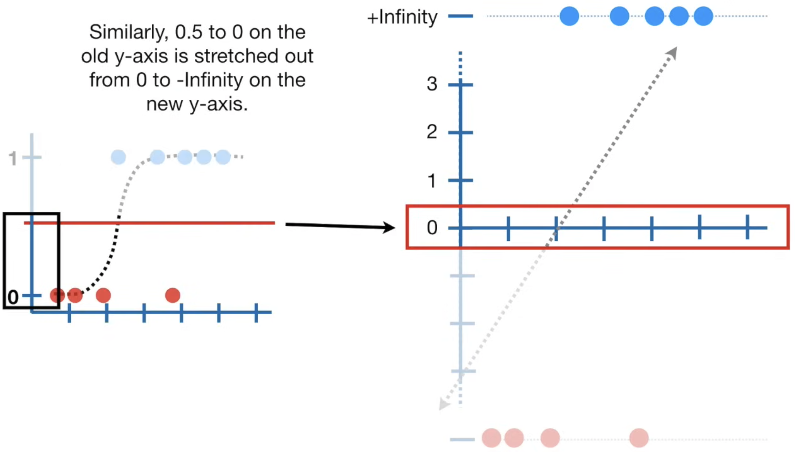 |  |
| 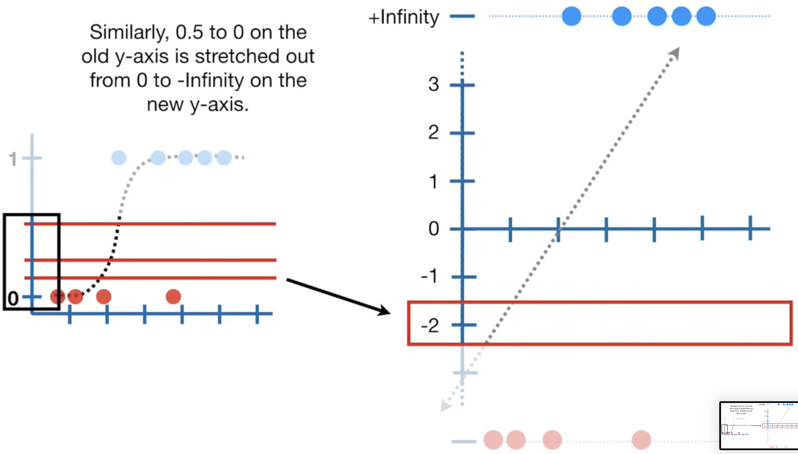 |  |
| 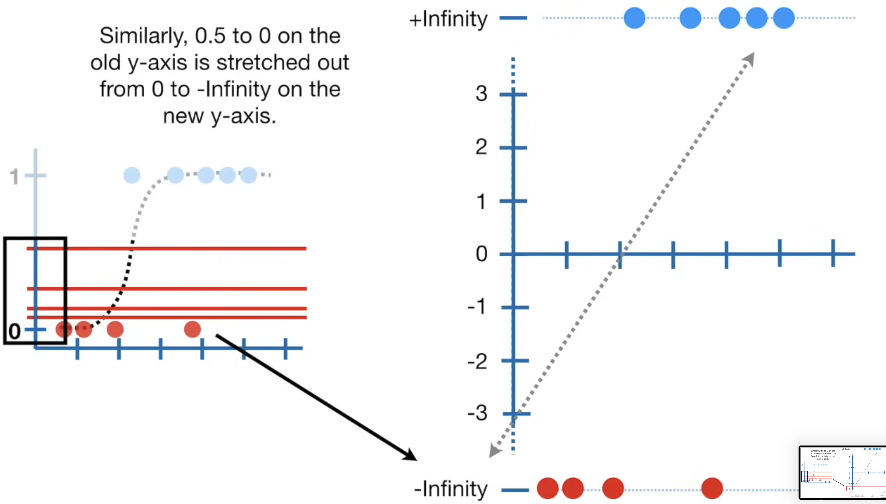 | 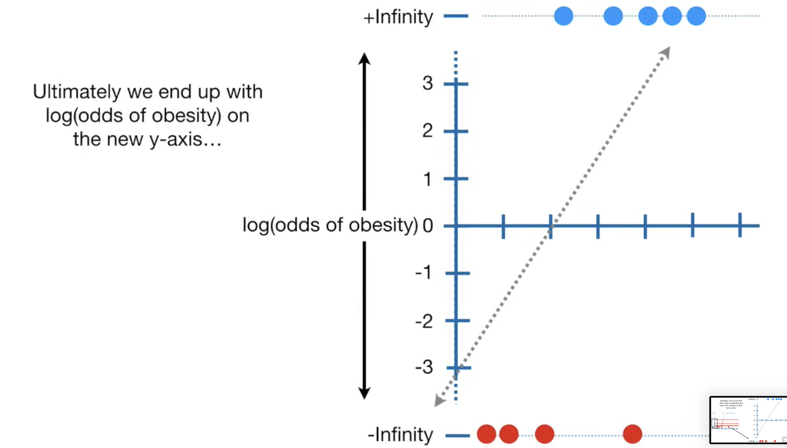 |
