[github perso](https://github.com/bruno-coulet/what-is-machine-learning)
[Machine learnia](https://www.youtube.com/watch?v=K9z0OD22My4&list=PLO_fdPEVlfKqUF5BPKjGSh7aV9aBshrpY&index=2)
[Machine learnia github](https://github.com/MachineLearnia/Python-Machine-Learning)
[StatQuest](https://www.youtube.com/watch?v=Gv9_4yMHFhI&list=PLblh5JKOoLUICTaGLRoHQDuF_7q2GfuJF&index=1&t=46s)

1. Dataset
2. modele
3. fonction de coût
4. algotithme de minimisation, **descente de gradient**

| dataset | variable cible (target) :<br>matrice $m * n$  (m lignes, 1 colonnes)<br>$$ y \in \mathbb{R}^{m \times 1} \quad $$variables explicatives (features) :<br>matrice $m * n$  (m lignes, n colonnes)<br>$$ \quad X \in \mathbb{R}^{m \times n}$$ |
| ------- | ------------------------------------------------------------------------------------------------------------------------------------------------------------------------------------------------------------------------------------------- |
| $m$     | nombre d'observations (lignes du dataset)                                                                                                                                                                                                   |
| $n$     | nombre de variables (colonnes de $X$)                                                                                                                                                                                                       |
| $y$     | vecteur des cibles $m \times 1$                                                                                                                                                                                                             |
| $X$     | matrice des variables explicatives $m \times n$                                                                                                                                                                                             |

| modele<br>*linéaire par exemple* | $$f_{(x)} = ax + b$$                           |
| -------------------------------- | ---------------------------------------------- |
| **fonction de coût**             | $$\frac{1}{2m} \sum_{i=1}^{m} (a.x + b -y)^2$$ |
| **algotithme de minimisation**   | **descente de gradient**                       |


## Conventions

matrice $m * n$  (m lignes, n colonnes)

| symbole                                      | signification                                                              |                                                                        |                                                           |
| -------------------------------------------- | -------------------------------------------------------------------------- | ---------------------------------------------------------------------- | --------------------------------------------------------- |
| $y$                                          | target                                                                     |                                                                        |                                                           |
| $x_1$  $x_2$  $x_3$ ...                      | features                                                                   |                                                                        |                                                           |
| $m$                                          | nombre d'observations du dataset                                           |                                                                        |                                                           |
| $n$                                          | nombre de features                                                         |                                                                        |                                                           |
| $x_3^{(2)}$<br><br>$x_{feature}^{(exemple)}$ | 3ème feature de l'observation 2                                            |                                                                        |                                                           |
| erreur                                       | valeur prédite - prédiction (ou l'inverse ) au carré ( ou en valer absolue | $(f_{(x^i)} - y_i)^2$<br><br> ou<br><br> $(y_i - f_{(x^i)})^2$<br>     | $(y_i - \hat{y})^2$<br><br>ou <br><br>$(\hat{y} - y_i)^2$ |
| $J(a,b)$                                     | fonction coût paramètre a et b                                             | somme (de $i$ à $m$) de toutes les $(erreurs)^2$/ nombre d'observation | $$\frac{1}{m} \sum_{i=1}^{m} (y_i - \hat{y})^2$$          |

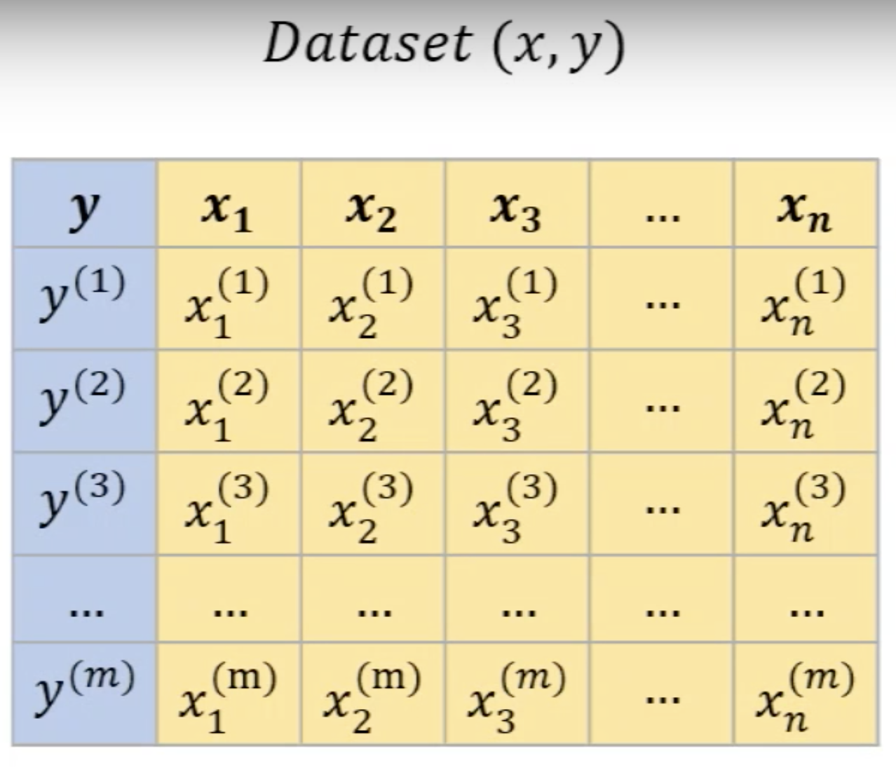

La data est coupée en 2  datasets Y et y :
- $X$ : variables explicatives (features) utilisées pour faire les prédictions ($m \times n$)
- $y$ : variable cible (target) que l'on veut prédire ( $m \times 1$)
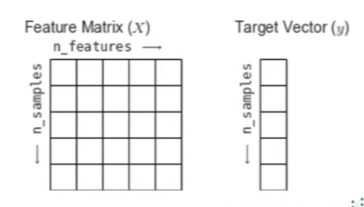


## Intro
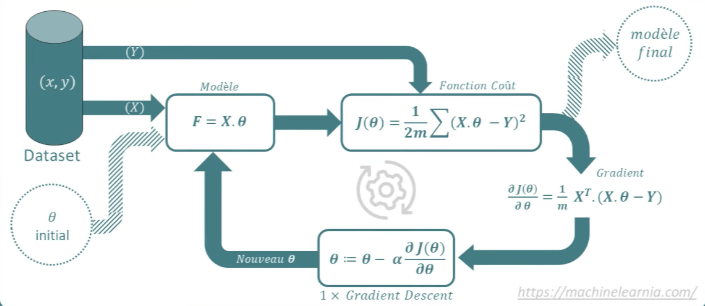
On choisi le modèle
la machine apprend/choisi les paramètres

Prédictions et classification

1. Training set : permet d'imaginer des méthodes de prédiction
2. Choix d'une méthode de prédiction
3. Testing set : mesure l'écart entre les prédictions et les donnée de test : 

- fonction de coût (erreurs entre les prédictions du modèle et les valeurs du dataset
- algorithme de minimisation de la fonction de coût en modifiant les paramètres

## Modele

modele linéaire univarié
paramètres $a$ et $b$
$m$ observation

|                                   Linéaire                                   |                                      Forme matricielle                                       | Paramètres                                  |
| :--------------------------------------------------------------------------: | :------------------------------------------------------------------------------------------: | ------------------------------------------- |
|                              $f_{(x)} = ax + b$                              |                                       $F = X . \theta$                                       | vecteur $\theta$                            |
| $$F = \begin{bmatrix}f_{(x^1)}\\f_{(x^2)}\\\dots\\f_{(x^m)}\\\end{bmatrix}$$ | $$X = \begin{bmatrix}x^{(1)} & 1 \\x^{(2)} & 1\\\dots & \dots \\x^{(m)} & 1\\\end{bmatrix}$$ | $\theta = \begin{bmatrix}a\\b\end{bmatrix}$ |

 $f_{(x^1)} \qquad = \qquad a.x^{(1)} + b \qquad = \qquad a.x^{(1)} +  1 . b$ 


**Pour pouvoir faire le calcul matriciel $X \times \theta$

Les dimensions des 2 matrices doivent être de type :
	  $m \times n$ 
	  $n \times \text{n'importe   quoi}$ 
  
il faut une dimension commune, ici $n$

Puisque le vecteur $\theta$ est de dimension $2 \times 1$
La matrice $X$ doit être de dimension $m \times 2$

On ajoute donc la colonne de $1$ dans la matrice $X$
Ainsi elle passe de $m \times 1$  à $m \times 2$ 


 - $n$ est le nombre de paramètres
- la matrice $X$ est de dimension $m * (n+1)$
- le vecteur $\theta$ est de dimension $(n + 1) * 1$ 
- On ajoute toujours au modèle et au dataset ce +1 qui correspond à une colonne de **biais**

pour obtenir toutes les valeurs de $f_{(x)}$
depuis $x = 1$
jusqu'a $x = m$ 


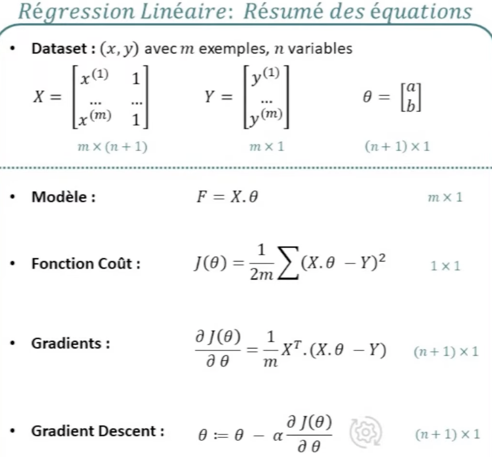


## Fonction de coût J(θ)
Mesure l'erreur entre les prédictions du modèle et les vraies valeurs.
**Regression**
- MSE (Mean Squared Error — erreur quadratique moyenne)
- MAE (Mean Absolute Error — erreur absolue moyenne)
- **Huber loss** (combine MSE et MAE, plus robuste aux outliers)
**Classification binaire**
- Log loss / Cross-entropy
**Classification multi-classes
- Cross-entropy multi-classes

Sert à entraîner le modèle en quantifiant l’erreur à minimiser pendant l’apprentissage.

Soit pour $m$ éléments :

| Forme Linéaire                                                                                                                                       |                  | Forme matricielle                                    | dimension | $J(\theta) =$                          |
| ---------------------------------------------------------------------------------------------------------------------------------------------------- | ---------------- | ---------------------------------------------------- | --------- | -------------------------------------- |
| $$\frac{1}{2m} \sum_{i=1}^{m} (a.x + b -y)^2$$                                                                                                       | $a.x + b$<br>    | $X.\theta$                                           | <br>$m*1$ | $$\frac{1}{2m} \sum (X.\theta - Y)^2$$ |
|                                                                                                                                                      | $-y$             | - vecteur $Y$  <br>                                  | $m*1$     |                                        |
|                                                                                                                                                      |                  | $X.\theta - Y$                                       | $m*1$     |                                        |
|                                                                                                                                                      | $(\dots)^2$      | chaque composante (donc le vecteur) est mis au carré | $m*1$     |                                        |
|                                                                                                                                                      | $\sum_{i=1}^{m}$ | on fait la somme de chaque élément<br>               | $1*1$     |                                        |
| Le facteur $\frac{1}{2}$​ est utilisé pour simplifier les dérivées (dans la descente de gradient, le 2 issu de la dérivée du carré s’annule avec ce  | $\frac{1}{2m}$   | divisé par $2m$                                      | $1*1$     | $\frac{1}{2}$                          |
|                                                                                                                                                      |                  |                                                      |           |                                        |

Utilise Testing Data pour évaluer les modèle de Machine Learning.  

L'important n'est pas comment un modèle colle au Training data mais de savoir si les prédictions sont justes.


## Descente de gradient
algorithme qui permet de **minimiser la fonction de coût**
en ajustant les paramètres du modèle $\theta$ pour réduire l'erreur.

| Forme matricielle                                                       |                                                                                                        |
| ----------------------------------------------------------------------- | ------------------------------------------------------------------------------------------------------ |
| $$\frac{\partial J(\theta)}{\partial \theta}$$<br>$(n + 1) * 1$<br><br> | Vecteur qui va calculer toutes les dérivé de $J$ par rapport à tous les paramètres du vecteur $\theta$ |
| $$\frac{1}{m} X^\top (X\theta - Y)$$<br>                                |                                                                                                        |
|                                                                         |                                                                                                        |
| α                                                                       | taux d’apprentissage (learning rate)                                                                   |
| $\frac{∂J(\theta)​}{∂θ_j}$​                                             | gradient (dérivée partielle du coût)                                                                   |


## Cross Validation

Les data sont découpées en n tranches
Certaines tranches sont destiné à l'entrainement, les tranches restantes sont réservées pour le test.

**Comment choisir quelle tranche sert au test ?**

La <font color="orange">cross validation</font> consiste à réserver alternativement toutes les tranches de donnée aux test.
Au final, toutes les données ont servies à l'entrainement et au test :

 Soit 4 tranches de données :
 
|||
|:-:|:-:|
| les 3 premières tranches sont utilisé pour l'entrainement | 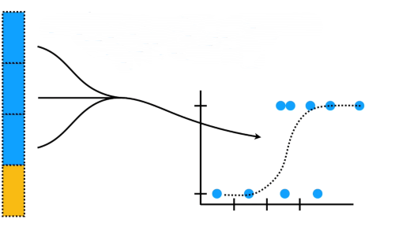|
| la 4ème tranche est réservé aux tests |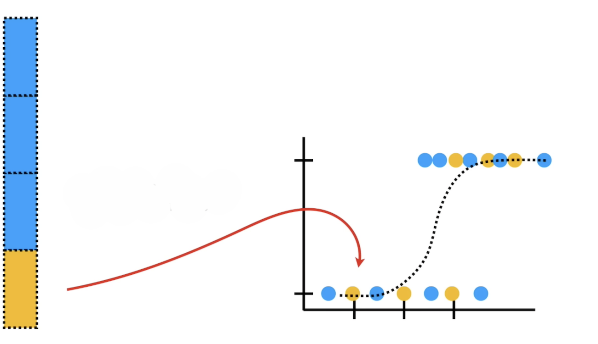|
| on note les résultats |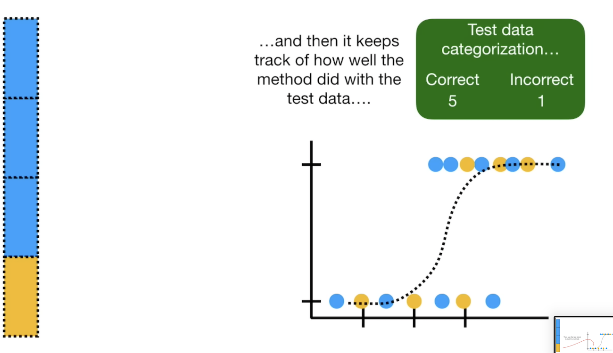|
| puis c'est la 3ème tranche qui est réservée aux tests, on note les résultats| | 
| puis c'est la 2ème tranche qui est réservée aux tests, on note les résultats| | 

Enfin c'est la 1ère tranche qui est réservée aux tests, on note les résultats et on les compile :

Ainsi toutes les données ont servies à l'entrainement et au test


Sert à comparer différentes méthodes de Machine Learning :
- Logistic regression
- k-nearest neighbors
- support vector machines
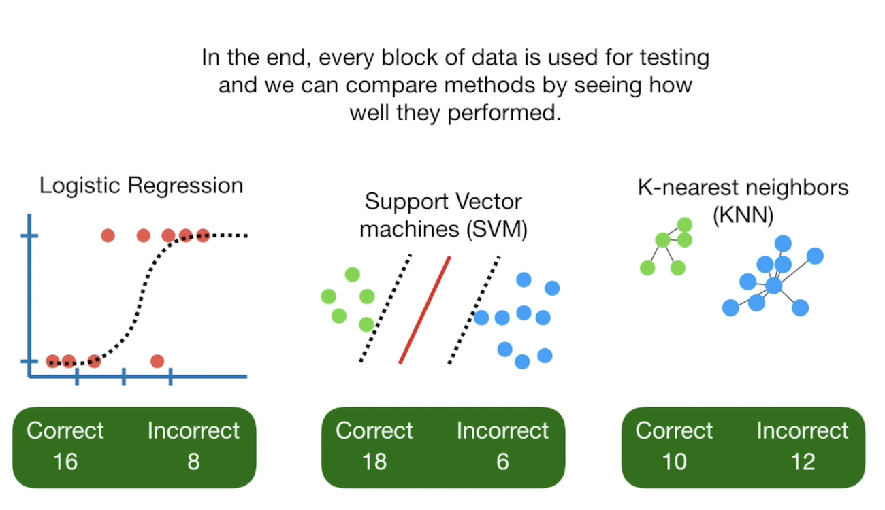
  

## Confusion Matrix
permet de calculer les métriques **Accuracy, Precision, Sensitivity,Specificity, F1-score**

 ```python
 confusion_matrix(y_train, y_pred)
 ```
Tableau à n ligne et n colonne pour n paramètres à vérifier
Permet de déterminer ce que le modèle à prédit correctement (diagonale verte) et incorrectement (faux positifs et faux négatifs en rouge)

**lignes** = classe réelles
**colonnes** = classe prédites

|                 | classe prédite 0                        | classe prédite 1                        |
| --------------- | --------------------------------------- | --------------------------------------- |
| **classe réelle 0** | <font color = green>vrai négatif</font> | <font color = red>faux positif</font>   |
| **classe réelle 1** | <font color = red>faux négatif</font>   | <font color = green>vrai positif</font> |

## Metrique evaluation
R2, RMSE, MAE, accuracy, F1-score…

Formule du coefficient de détermination $R^2$
$$R^2 = 1 - \frac{\sum_{i=1}^{n} (y_i - \hat{y}_i)^2}{\sum_{i=1}^{n} (y_i - \bar{y})^2}
$$

- mesure la proportion de la variance de la variable cible expliquée par le modèle.
  
- Peut être négatif si le modèle est pire que la moyenne des $y$

|           |                                                        |
| --------- | ------------------------------------------------------ |
| $R^2=1$   | prédiction parfaite                                    |
| $R^2 = 0$ | le modèle n’explique pas mieux que la moyenne des $y$. |


| `precision_score(y_true, y_pred)`                                      |
| ---------------------------------------------------------------------- |

| Accuracy                                | F1-score                                                                                    |
| --------------------------------------- | ------------------------------------------------------------------------------------------- |
| Taux de prédictions correctes           | Moyenne harmonique entre Precision et Recall                                                |
| $$ \frac{VP + VN}{VP + VN + FP + FN} $$ | $$ \frac{2 \cdot \text{Precision} \cdot \text{Recall}}{\text{Precision} + \text{Recall}} $$ |
| % des cas bien classés                  | Mesure globale en cas de déséquilibre                                                       |
| `accuracy_score(y_true, y_pred)`        | `f1_score(y_true, y_pred)`                                                                  |

| Sensitivity (Recall)                         | Specificity                          | Precision                           |
| ------------------------------------------- | ------------------------------------ | ----------------------------------- |
| Taux de vrais positifs (TPR)                | Taux de vrais négatifs (TNR)         | Taux sur les positifs prédits       |
| $$ \frac{VP}{VP + FN} $$                    | $$ \frac{VN}{VN + FP} $$             | $$ \frac{VP}{VP + FP} $$            |
| % des cas positifs correctement détectés    | % des cas négatifs bien rejetés      | % des positifs prédits corrects     |
| `recall_score(y_true, y_pred)`              | (à calculer manuellement)            | `precision_score(y_true, y_pred)`   |

```python
from sklearn.metrics import confusion_matrix
tn, fp, fn, tp = confusion_matrix(y_true, y_pred).ravel()
specificity = tn / (tn + fp)

```


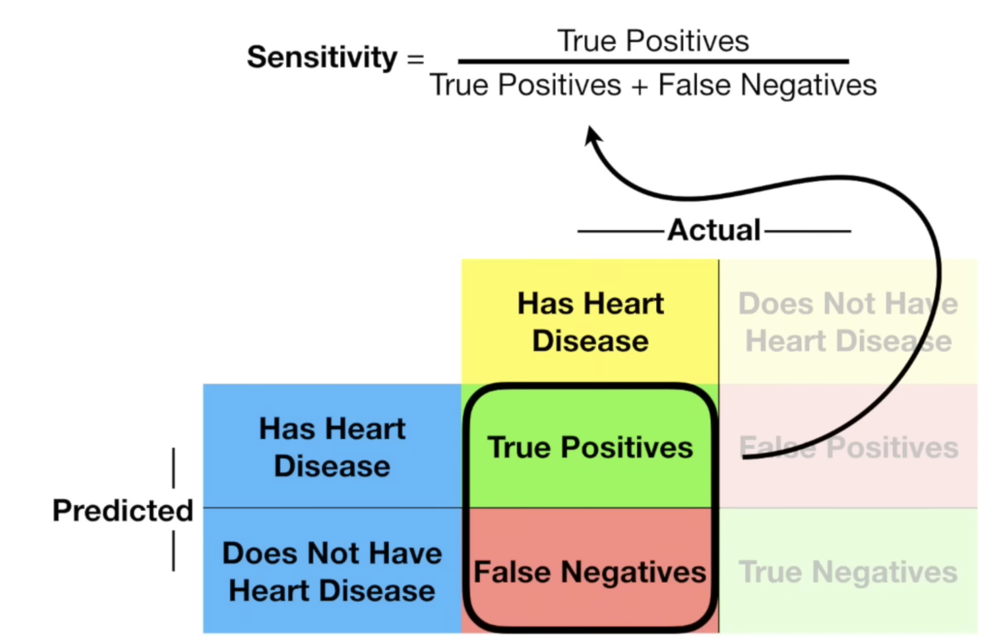


=   Vrais négatifs / (vrais négatifs + faux positifs)
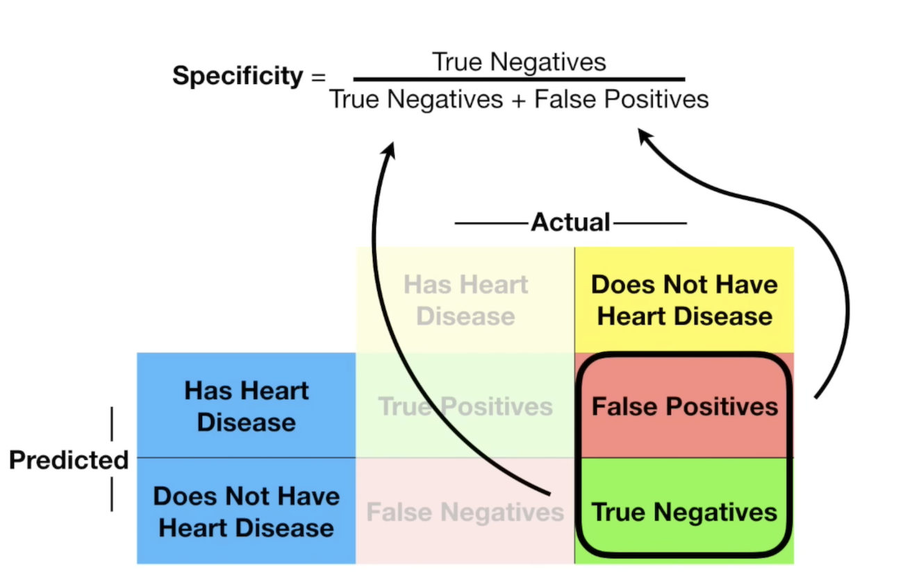


## ROC
**Receivor Operator Characteristic**
Aide à choisir le meilleur seuil pour catégoriser les données

Essayons de savoir si une souris est obèse (1) ou pas (0) en sachant son poids

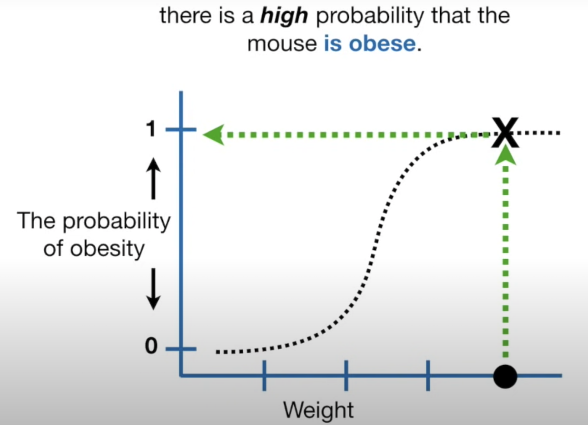

Les souris rouges ne sont pas obèses (0)
Les souris bleues sont  obèses (1)
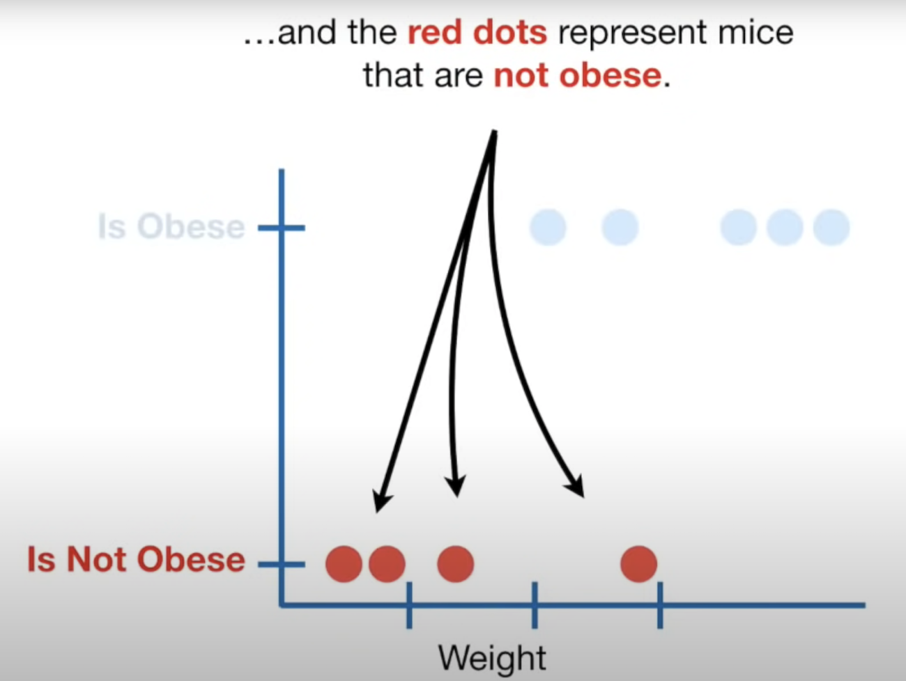

Avec un seuil à 0,5

| Classification   | Seuil  |
| ---------------- | ------ |
| souris obèse     | >= 0,5 |
| souris pas obèse | <= 0,5 |


**Comparaison des différent seuils**
Specificity = Vrais négatifs / (vrais négatifs + faux positifs)
Sensitivity =   Vrais positifs / (vrais positifs + faux négatifs)


## AUC
Area Under The Curve (ROC cuve)


