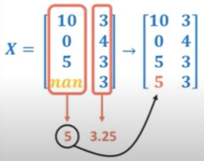
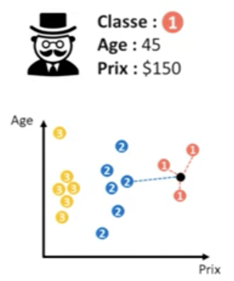
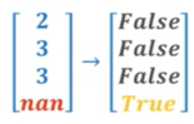

`np.nan` not a number

### Indiquer les valeurs manquantes

`-99`, `-999999`, -1, `np.inf`, `np.nan` sont souvent des signe de valeurs manquantes

Il y a 3 grand transformers dans le module `impute` :
### `SimpleImputer`
Remplace toutes les valeurs manquantes par une valeur statistique

`strategy =`
- `mean`
- `median`
- `most_frequent`
- `constant`

`fill_value` pour `constant`

```python
imputer = SimpleImputer(missing_values=np.nan, strategy='mean')

# calcule la moyenne de la colonne du train_set
# et remplace la valeur manquante
imputer.fit_transform(X_train)

# remplace la valeur manquante du test_set par la moyenne
# précédemment calculée
imputer.transform(X_test)
```


### `KNNImputer`
Remplace les valeurs manquantes d'un échantillon par les valeurs des échantillons qui lui ressemble le plus.

- `n_neighbors`

```python
imputer = KNNImputer(n_nrighbors=1)
imputer.fit_transform(X)
```


### `iterativeimputer`


### `missingIndicator`
Variable booléenne qui indique l'absence de valeurs dans le dataset


par exemple dans le titanic, si il n'y a pas d'info sur la classe, l'age, la cabine, etc... c'est peut être qu'il s'agit d'un membre d'équipage :
Le manque d'information peut être une information


```python
pipeline = make_union(SimpleImputer(strategy='constant',fill_value=-99),
					     MissingIndicator())
pipeline.fit_transform(X)
```

On peut optimiser le nombre de paramètre du KNNImputer grace à l'algorithme de GridSearchCV :

```python
import seaborn as sns
titanic = sns.load_dataset('titanic')
X = titanic[['pclass', 'age']]
y = titanic['survived']

X_train, X-test, y_train, y_test = train_test_split

model = make_pipeline(KNNImputer(), SGDClassifier())

params = {
  # <Composant>__<paramètres> : [....]
	'knnimputer__n_neighbors' : [1, 2, 3, 4]
}

grid = GridSearchCV(model, param_grid=params, cv=5)

grid.fit(X_train, y_train)

grid.best_estimator
grid.best_params_


```

