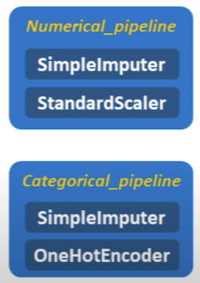
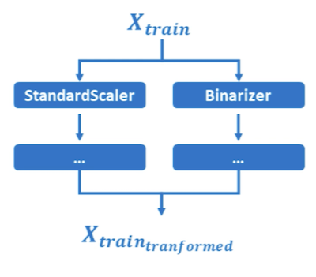
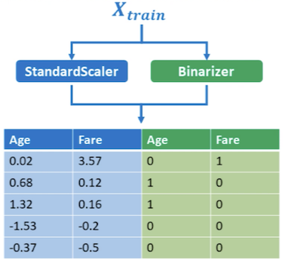

### Principe général du pipeline
pipeline = chaine de transformation


1. On développe un/des transformer sur le train set
2. Cela permet d'entrainer un estimateur

3. On utilise ces mêmes transformer pour traiter les donnée du test set
4. On peut ensuite fournir ces données traitées à l'estimateur pour faire des prédictions

### `make_column_transformer`
paramètre : dans un tuple, l'opération de transformation, suivie de la liste des colonnes concernées par la transformation
```python
# Syntaxe
make_column_transformer((transformer, ['colonne_1', 'colonne_2', ...])

# création du transformer
transformer = make_column_transformer((StandardScaler, ['age', 'income', ...])

# applique StandardScaler aux colonne age et income du dataset X
transformer.fit_transform(X)
```


### `make_column_selector`
3 arguments aux choix :
- `dtype_include`      par exemple : `np.number`
-  `dtype_exclude`         par exemple : `object`
- `pattern`   (avec des regex)

### Tri des variables catégorielles et numériques

```python
X = ...toutes les colonnes sauf la target
y = ...la target

# 2 possibilités : lister les colonnes, ou exclure tout ce qui est numérique
categorical_features = ['age', '...', '...']
categorical_features = make_column_selector(dtype_exclude=np.number)
# 2 possibilités : lister les colonnes, ou sélectionner tout ce qui n'est pas numérique
numerical_features = ['sex', '...', '...']
numerical_features = make_column_selector(dtype_include=np.number)

categorical_pipeline = make_pipeline(SimpleImputer(),
									 StandardScaler())
									 
numerical_pipeline = make_pipeline(
SimpleImputer(strategy = 'most_frequent'),
OneHotEncoder()
)

# Applique les transformations voulues aux colonnes adéquates
preprocessor = make_column_transformer(
	(categorical_pipeline, categorical_features),
	(numerical_pipeline, numerical_features)
)

# Pipeline final
model = make_pipeline(preprocessor, SGDClassifier())

model.fit(X,y)
```

### `make_union`
met en parallèle plusieurs transformers et concatène le résultat

```python
pipeline_en_parallele = (make_union(StandarScaler(), Binarizer())
pipeline_en_parallele (numerical_feature)
```

