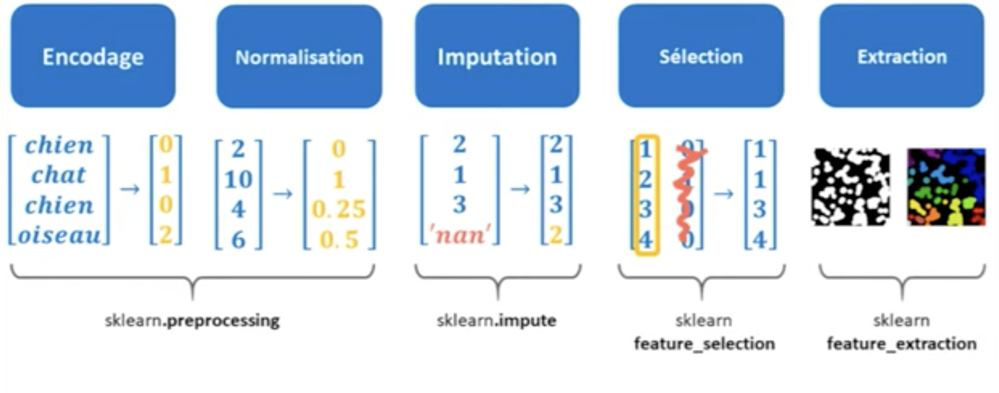

 

![[transformer_estimator_2.png]]

1. Régularisation
Utiliser les pénalités L1 ou L2 dans les modèles.

2. Analysez l'importance des variable par
rapport à la cible pour quantifier l'impact :
`model.coef_` ou `permutation_importance` 

3. Vérifier les interactions
Confirmez que les nouvelles variables capturent bien l'information souhaitée.

**Encodage**
converti les qualitatives en valeurs numériques

**Normalisation**
met sur une même echelle toute les variables quantitatives

**Imputation** 
remplace les données manquantes par une valeur statistique

**Selection** 
ne garder que les variables les plus utiles aux modele

**Extraction**
génère de nouvelles variables à partir des info cachées dans le dataset

module `sklearn.preprocessing`

### encodage **Target-Based**
**encodage basé sur la cible**
**technique d'encodage des variables catégorielles**
chaque catégorie est remplacée par une **statistique calculée à partir de la variable cible**.

**Objectif**
Transformer des **variables catégorielles** en **valeurs numériques**, tout en **préservant l'information sur la relation entre la catégorie et la variable cible**.

Pour chaque catégorie d'une variable catégorielle, on calcule une **statistique** de la **variable cible** (target), comme :

- La **moyenne** (très fréquent en régression ou classification binaire)
- La **médiane**
- Le **log des odds** (pour la classification)
- Autres statistiques personnalisées

Puis, on **remplace chaque catégorie** par cette valeur.

| Ville     | achète | moyenne de "achète" | ville encodée |
| --------- | ------ | ------------------- | ------------- |
| Paris     | 1      | (1+1+0)/3 =         | 0.66          |
| Lyon      | 0      | (0+1)/2 =           | 0.5           |
| Paris     | 1      |                     | 0.66          |
| Marseille | 0      | 0/1 =               | 0             |
| Lyon      | 1      |                     | 0.5           |
| Paris     | 0      |                     | 0.66          |

## Risques

- **Fuite de données (data leakage)** : on encode avec la moyenne de la cible incluant les données qu'on veut prédire
    
     Solution : faire l'encodage **avec des moyennes calculées sur les données d'entraînement uniquement** (ou via **cross-validation**)
        
- **Surapprentissage** : sur certaines catégories peu fréquentes, la moyenne peut être instable