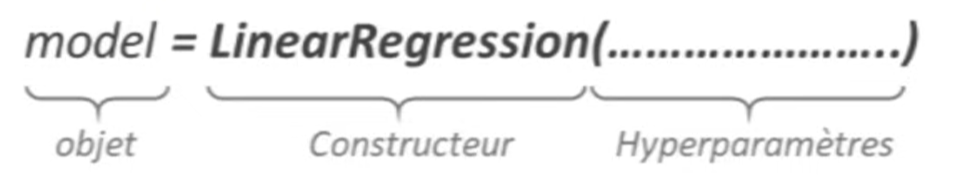
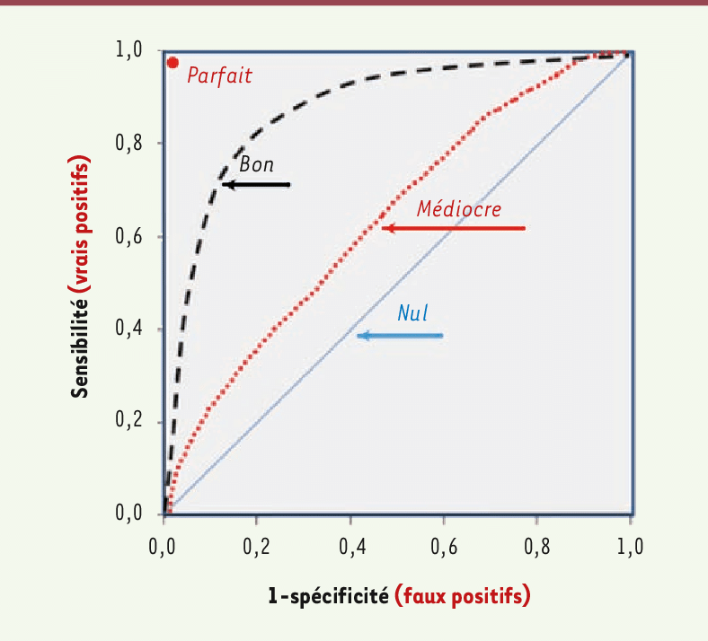

[Machine Learning avec sickit Learn, Aurélien Géron, ed. Dunod](https://github.com/ageron/handson-ml2)

Basé sur [[Numpy]]
Entrée : array, DataFrame
Sortie : array

1. Préparation des données
2. Séparation des données (apprentissage / validation)
3. Importation des classes nécessaires
4. [Instanciation de la classe à un objet modèle avec hyperparamètre(s)](#initialiser_un_modele)
5. [Ajuster des paramètres du modèle aux données (`.fit`)](#entrainer_un_modele)
6. Validation du modèle
## Initialiser un modèle
Sélectionner un estimateur et préciser ses hyperparamètres (nombre de neurones, nombre d'arbres, ...)




### Entrainer un modèle
method `.fit`

```python
model.fit(X, y)
```

données ``X`` et ``y`` dans 2 tableau numpy à 2 dimensions :

- Matrice `X`       `m` = nb d'échantillons
             `n` = nb de features présent dans le dataset `m x n`
             
- Vecteur`y`        `m` = nb d'échantillons
             `n` = nb de target  (une) présent dans le dataset `m x 1`
    


### Evaluer un modèle
méthod `.score`
```python
model.score(X,y)
```

### Utiliser le modèle
méthod `.predict`
```python
model.predict(X)
```

### Regression linéaire

```python
model = LinearRegression()
model.fit(X, y)
model.score(X, y)
model.predict(X)
```

## Métriques pour valider un modèle

module `metrics`

### Classification

#### Accuracy
$$\text{Accuracy} = \frac{\text{observations bien classées}}{\text{total observation}}$$

Problématique quand la variable cible positive est très inférieur à la variable cible négative, la fraude à la carte de crédit par exemple (très peu de transaction frauduleuse)


#### Matrice de confusion

dure à interpréter quand les classes sont fortement déséquilibrées

```python
confusion_matrix(y_test,y_predict)

classification_report(y_test,y_predict)
```

 permet de lire le croisement entre les valeurs observées et les valeurs prédites

| valeur de la donnée             | prédiction                                                                                                                                              | prédiction                                |                                                                                                                                                                      |     |
| ------------------------------- | ------------------------------------------------------------------------------------------------------------------------------------------------------- | ----------------------------------------- | -------------------------------------------------------------------------------------------------------------------------------------------------------------------- | --- |
|                                 |                                                                                                                                                         |                                           |                                                                                                                                                                      |     |
|                                 | <font color = "yellow">Positive                                                                                                                         | <font color = "yellow">Negative           |                                                                                                                                                                      |     |
| <font color = "yellow">Positive | <font color = "green">true positive<br>TP                                                                                                               | <font color = "red">false negative<br>FP  | $$\text{Sensibilitée (ou Recall)} =\frac{\textcolor{green}{\text{vrai positif}}}{\textcolor{green}{\text{vrai positif}} +\textcolor{red}{\text{faux négatif}}}$$<br> |     |
| <font color = "yellow">Negative | <font color = "red">False positive<br>FP                                                                                                                | <font color = "green">True negative<br>TN | $$\text{spécificité} =\frac{\textcolor{green}{\text{TN}}}{\textcolor{green}{\text{T N}} +\textcolor{red}{\text{FP}}}$$<br>                                           |     |
|                                 | precision =<br><font color = "green">true positive</font> / (<font color = "green">true positive</font> + <font color = "red">False positive</font><br> |                                           |                                                                                                                                                                      |     |

$$
F_1 =
\frac{
  2 \times \text{précision} \times \text{rappel}
}{
  \text{précision} + \text{rappel}
}
$$
$$
\begin{array}{|c|c|}
\hline
\textbf{Métrique} & \textbf{Formule} \\
\hline
\text{Précision} &
\frac{
  \textcolor{green}{\text{VP}}
}{
  \textcolor{green}{\text{VP}} + \textcolor{red}{\text{FP}}
} \\
\hline
\text{Rappel (Sensibilité)} &
\frac{
  \textcolor{green}{\text{VP}}
}{
  \textcolor{green}{\text{VP}} + \textcolor{red}{\text{FN}}
} \\
\hline
\text{Spécificité} &
\frac{
  \textcolor{green}{\text{VN}}
}{
  \textcolor{green}{\text{VN}} + \textcolor{red}{\text{FP}}
} \\
\hline
\text{F-mesure} &
\frac{
  2 \times \text{précision} \times \text{rappel}
}{
  \text{précision} + \text{rappel}
} \\
\hline
\end{array}
$$

#### courbe ROC

Receiver Operating Characteristics

proportion des vrais positifs en fonction de la proportion des faux positifs

représente le recall en fonction de (1 - specificity) sur une courbe en faisant varier le seuil de classification (point à partir duquel une observation est considérée comme positive)

tpr = true positive rate
fpr = false positive rate

```python
proba = modele_choisi.predict_proba(x_test)[:, 1]

fpr, tpr, _ = roc_curve(proba, test_x)
plt.plot( fpr, tpr, label="modèle choisi")
```



modèle aléatoire en bleu
un modèle parfait monterai le long de l'axe des ordonné jusqu'a y=1, puis longerai l'axe des abscices en restant à y = 1, c'est à dire 0 faux positif, que des vrais positif
### AUC

Le **ROC** permet de calculer l'aire sous la courbe :
- modèle aléatoire, AUC = 0.5
- modèle parfait, AUC = 1


