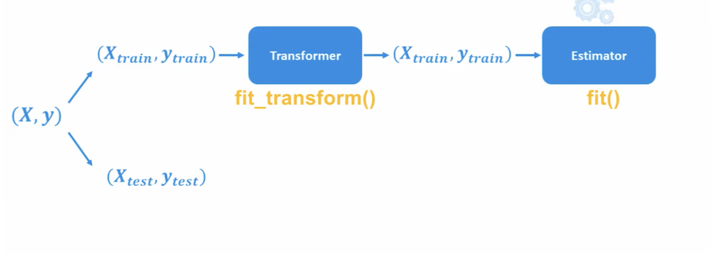

https://www.youtube.com/watch?v=0B5eIE_1vpU
https://calmcode.io/course/scikit-learn/introduction
https://github.com/koaning/calm-notebooks
## intro


```python
# il faut cette version pour ce tutoriel
%pip install --upgrade scikit-learn==0.23.0
```

**Estimateur**
Classe ou objet qui implémente les méthodes `fit()`<br> et souvent `predict()`, `transform()`
Un modèle "vide", prêt à apprendre à partir des données d'entraînement

```python
LinearRegression()
RandomForestClassifier()
KMeans()
```

**Model**
Instance de l’estimateur qui a été entraînée, qui a appris à partir des données, contient les paramètres appris
`fit()` a été appelé

```python
model = LinearRegression()
model.fit(X_train, y_train)  # → le modèle est entraîné ici
```


## Schéma de base
data -> model -> prédiction

1. La data est coupée en 2  dataset Y et y

- dataset X : variables explicatives (features) utilisées pour faire les prédictions (m ** n)
- dataset y : variable cible (target) que l'on veut prédire ( m * 1)
2. créer le model, un objet python
3.  Entrainement : le modèle apprend à partir de la data  `.fit(X,y)`
4.  Validation, prédiction `.predict()` et [[Machine learning# metrique_evaluation|mesure]]  `.score()`
5. Test
### Import de dataset 

#### Depuis scikit-learn

scikit-learn propose de nombreux datasets, comme `load_boston` par exemple
Si on appel le dataset tel quel, on obtient un dictionnaire :
```python
from sklearn.datasets import load_boston
load_boston()
```

Le paramètre `return_X_y=True` permet de diviser le dataset en 2 arrays X et y :
```python
load_boston(return_X_y=True)
# On peut s'en servir pour créer les variable X et y
X, y = load_boston(return_X_y=True)
```

Autre méthode :
```python
# Chargement du dataset
data = load_boston()
# Récupérer X (features) et y (target)
X, y = data.data, data.target
```


### Depuis un fichier externe 

Lorsque le dataset ne provient pas de scikit-learn (par exemple un fichier `.csv`), on utilise généralement la bibliothèque `pandas`.

```python
import pandas as pd
# Chargement du dataset
df = pd.read_csv("mon_dataset.csv", sep="mon_séparareur", index_col="ma-colonne-index")
```

Séparation des variables explicatives (features) et de la cible (target)
`axis=1` indique qu'on supprime la colonne.
```python
X = df.drop("col_target", axis=1)
# ou
X = df[["col_1", "col_2", ...]]
# et
y = df["col_target"]
```
## Preprocessing
data -> preprocessing + model -> prédiction

Les variable explicatives (features) du dataset X, utilisées pour faire les prédictions ne ont parfois des échelle différentes.

`preprocessing` : selon le modèle utilisé, il faut harmoniser les variables
`pipeline`  : pour que chaque étape soit effectuée dans l'ordre


```python
# classes Pipeline et Mise à l'échelle 
from sklearn.preprocessing import StandardScaler
from sklearn.pipeline import Pipeline

# Dans l'objet pipeline : une liste de [tuples (nom, objet)]
pipe = Pipeline([
	# objet pour le prétraitement : mise à l'échelle des données
	("scale", StandardScaler()),
	# objet modèle de régression
	("model", KNeighborsRegressor())
	 ])

# Entraînement du pipeline sur les données X (features) et y (cible)
# le pipeline est appelé à la place du modèle
pipe.fit(X, y)
# Prédiction : idem
pred = pipe.predict(X)

# version raccourcie qui entraîne et prédit en une seule ligne
pred = pipe.fit(X, y).predict(X)

# Affichage du nuage de points
plt.scatter(pred, y)
```

### Transformer

1. méthode `.fit()`
   développe une fonction de transformation en analysant les données
2. méthode `.transform()`
   applique la fonction de transformation sur toutes les données qu'on lui fournis
   (train, test, et future)
3. méthode `.fit_transform()`
   combine `.fit()` et `.transform()`

```python
transformer = LabelEncoder()
transformer.fit(X)
transformer.transform(X)
```


### Encodage

Dans scikitlearn, il existe 5 transformers d'encodage :
#### Encodage ordinale

- `LabelEncoder()` conçu spécialement pour la variable $y$ ( de 0 à n_classe - 1)
  `inverse_transform()` permet de décoder les données
- `OrdinalEncoder()`conçu spécialement pour les variables $X$ 

Associe chaque classe d'une variable à une valeur décimale unique


#### Encodage OneHot

- `LabelBinarizer()`
- `MultiLabelBinarizer()`
- `OneHotEncoder()`
- 
Chaque classe est représenter en binaire dans une colonne propre


### Normalisation
mettre toutes les données quantitative sur une même echelle
facilite l'apprentissage des modèles de descente de gradient ou de calculs de distance ou de variance


strandardistation sensible aux valeurs abérantes, cela rend les données difficiles à exploiter

| Normalisation    | Effet                                                                                                                                                                                                                                          |
| ---------------- | ---------------------------------------------------------------------------------------------------------------------------------------------------------------------------------------------------------------------------------------------- |
| `MinMaxScaler`   | transforme chaque variable X pour qu'elle soit comprise entre 0 et 1<br><br>$$ X_{scaled} = \frac{X - X_{min}}{X_{max} - X_{min}}$$<br><br>$$\begin{bmatrix}70 \\80 \\120\end{bmatrix}\Rightarrow\begin{bmatrix}0 \\0.2 \\1\end{bmatrix}$$<br> |
| `StandardScaler` | transforme chaque variable X pour que  la moyenne = 0 et l'écart type = 1<br>$$ X_{scaled} = \frac{X - \mu_X}{\sigma_X}$$<br>$$\begin{bmatrix}70 \\80 \\120\end{bmatrix}\Rightarrow\begin{bmatrix}-0.92 \\-0.46 \\1.38\end{bmatrix}$$          |
| `RobustScaler`   | $$ X_{scaled} = \frac{X - \text{mediane}}{\text{IQR}}$$<br>$$\begin{bmatrix}70 \\80 \\120\end{bmatrix}\Rightarrow\begin{bmatrix}-0.4 \\0 \\1.6\end{bmatrix}$$                                                                                  |
```python
X = np.array([[70],
              [80],
              [120]])
scaler = MinMaxScaler() # ou StandardScaler()
scaler.fit_transform(X)
```


### Création de polynômes
`PolynomialFeatures()`
Crée des variable polynomiales à partir des variables existantes
exemple à partir de la variable $X$ :
- biais (que des 1)
- $X$ (la variable originale)
- $X^2$ (la variable originale au carré)

La machine apprend alors un modèle : $f_{(x)} = ax^2 + bx + c$

**Exemple :**
vecteur d’entrée : $(x_1,\ x_2)$
devient :                 $(1,\ x_1,\ x_2,\ x_1^2,\ x_1 x_2,\ x_2^2)$
- Le **degré 0** donne le terme constant : `1`
- Le **degré 1** donne : $x_1$, $x_2$
- Le **degré 2** donne :
    - $x_1^2$
    - $x_1 x_2$
    - $x_2^2$

<font color="orange">Il faut normaliser les données après avoir utilisé PolynomialFeature()</font>
### Discretisation

`Binarizer()` discrétise une variable en 2 catégories en fonction d'un seuil :
- 'threshold='
- tous ce qui est au dessus est  classé `1`
- tous ce qui est au dssous est  classé `0`

`KBinsDiscretizer()` idem en plusieurs caégories `n_bins=`
### Personnalisation
On peut créer un transformer avec à l'intérieur les fonctions que l'on veut
```python
Mon_transformeur = FunctionTransformer(func = np.log1p, inverse_func= np.expm1, ...)
```

### Transformation non linéaire
`PowerTransformer()`


### Feature_selection
Ensemble de transformers et de fonctions

 `VarianceThreshold()` élimine les variables dont la variance est inférieur à un certain seuil ( A quoi sert une variable qui ne varie pas)
```python
# axis=0 calcule la variance le long des lignes de X
# Calcule donc la variance de chaque colonne (feature)
# Le résultat est un vecteur de variances
X.var(axis=0)

selector = VarianceThreshold(threhold=0.2)
selector.fit_transform(X)
# retourne quelle variable a été selectionnée (tableau de booléens)
selector.get_support()
```
 


### Pipeline
pipeline = chaine de transformation
- Plus simple à utiliser
- Plus sécuriser (fuite de données, problèmes de transformation)
- Permet de faire des cross validations avec `GridSearchCV`


1. On développe un/des transformer sur le train set
2. Cela permet d'entrainer un estimateur

3. On utilise ces mêmes transformer pour traiter les donnée du test set
4. On peut ensuite fournir ces données traitées à l'estimateur pour faire des prédictions


```python
from sklearn import make_pipeline

model = make_pipeline(StandardScaler(), SGDClassifier())
model.fit(X_train, y_train)
model.score(X_test, y_test)
model.predict(X_test)
```

Avec une validation croisée GridSearchCV :

```python
from sklearn import make_pipeline
from sklearn.model_selection import GridSearchCV

model = make_pipeline(PolynomialFeatures(),
                      StandardScaler(),
					  SGDClassifier(random_state=0)
					  )
params = {
	'polynomialfeatures__degree' : [2, 3, 4] # entre 2, 3 et 4 degrés
	'sgdclassifier__penalty' : ['l1', 'l2']
}

grid = GridSearchCV(model, params_grid=params, cv=5)

grid.fit(X_train, y_train)

# affiche les meilleurs paramètres
grid.best_params_
# Affiche la performance
grid.score(X_test, y_test)
grid.predict(X_test)
```

## Model

```python
# Importation des modèles
from sklearn.neighbors import KNeighborsRegressor
from sklearn.linear_model import LinearRegression

# Régression linéaire
model = LinearRegression()
# 2 entrainement du modèle avec les données
model.fit(X, y)
# calcul le coéfficient de détermination R2
model.score(X,y)
# 3 prédiction
mod.predict(X)

# idem avec K plus proches voisins
mod = KNeighborsRegressor()
mod.fit(X, y)
mod.predict(X)
```

```python
# sélection d'un modèle et ajustment
mod = KNeighborsRegressor().fit(X, y)
# prédiction
pred = mod.predict(X)
# nuage de point
# valeurs des prédiction X en abcisses
# valeurs réelle (target) y en ordonnées
plt.scatter(pred, y)
```

```python
# sélection et ajustement d'un modèle de classification
mod = KNeighborsClassifier().fit(X, y)
#prédiction de la classe de X
mod.predict(X)
>>>[0]
# probabilitée de X d'apartenir à la classe 0 et 1
mod.predict_proba(X)
>>>[[0.6 0.4]]
```


## Entrainement et validation

### `train_test_split`
<font color ="orange">Il ne faut jamais évaluer la performance du modèle sur les données d'entrainement</font>
- Le modèle **a déjà vu** ces données : il peut simplement les "mémoriser".
- Cela donne une **estimation biaisée** de la performance.
<font color ="orange">On évalue la performance du modèle sur les données de test</font>

| Data      | proportions usuelles | methode scikit_learn               |
| --------- | -------------------- | ---------------------------------- |
| train set | 80 %                 | $model.fit(X_{train},y_{train})$\| |
| test set  | 20 %                 | $model.score(X_{test},y_{test})$   |


```python
# Entrainement sur le jeu d'entrainement
model.fit(X_train, y_train)

# calcul de la performance sur LE JEU DE TEST
model.score(X_test, y_test)
```

`train_test_split` :
1. mélange le dataset
   (on peut donner une valeur au paramètre `random_state`pour retrouver le même mélange )
2. diviser le dataset en 2 parties


```python
from sklearn.model_selection import train_test_split()
from sklearn.neighbors import KNeighborsClassifier

X = dataset[['feature_1', 'feature_2', 'feature_n']]
y = dataset['target']

X_train, X_test, y_train, y_test = train_test_split(X, y, test_size=0.2)

model = KNeighborsClassifier(n_neighbors=4)

model.fit(X_train, y_train)
print("Score d'entrainement : ", model.score(X_train, y_train))
# print("Score de test :", model.score(X_test, y_test))

```

### Cross Validation `cross_val_score`
Evite un éventuel biais dû à l'échantillonnage aléatoire du jeu de donné

Pour améliorer le modèle, il faut un jeu de validation pour tester les réglages du model qui donnent les meilleures performances sans utiliser le jeu de test

<font color="orange">Le train set est divisé en train set et validation set</font>

Le jeu d'entrainement est coupé en tranches, dont une partie sert de jeu de validation :
Entraine puis valide le modèle sur plusieurs découpe possible du train set 


```python
from sklearn.model_selection import cross_val_score

# cv = nombre de split du cross validation = nombre d'entrainements
# scoring = choix du métrique pour évaluer le modèle
# .mean() fait la moyenne des scores des différents entrainements
cross_val_score(KNeighborsClassifier(), X_train, y_train, cv=5, scoring="accuracy").mean()
```
<font color="orange">Reste à tester différent paramètres pour voir quel réglage donne le meilleur score moyen</font>

| Training, Validation, Test                |
| ----------------------------------------- |
|  |

### `validation_curve`
fait varier un hyperparamètre
mesure les performances du model
détecte l'overfitting → le score entraînement est haut et validation bas
détecte l'underfitting → les deux scores sont bas

| Paramètres de `validation_curve`                   | exemples           |
| -------------------------------------------------- | ------------------ |
| modèle                                             | `model`            |
| données du train set                               | `X_train, y_train` |
| hyperparamèttre qu'on veut régler                  | `n-neighbors`      |
| un itérateur pour les valeurs que l'on veut tester | `k` = 1 ... 49     |
| nombre de découpe dans le cross validation         | `cv=5`             |


```python
from sklearn.model_selection import validation_curve

# 49 valeurs
k = np.arrange(1,50)
# 49 valeurs sont testées avec cv=5
train_score, val_score = validation_curve(model, X_train, y_train, 'n_neighbors', k, cv=5)
```

Affiche 
- en ordonnée les valeurs de l'hyperparmètre
- en abscisse la moyenne de chaque ligne (cross_validation = 5, donc 5 scores par itération
- idem pour l'entrainement et la validation

```python
plt.plot(k, val_score.mean(axis=1), label='validation')
plt.plot(k, train_score.mean(axis=1, label='train')

plt.ylabel('score')
plt.xlabel("valeur de l'hyperparametre n-neighbors")
plt.legend()
```
### `grd_search_cv`

pour tester toutes les combinaisons d'hyperparamètres

param_grid = dictionnaire { } avec :
- les hyperparamètres à régler
- les différentes valeurs à tester de chaque hyperparamètre
- 


```python
grid = grid_search_cv (
	model,
	dictionnaire,
	nombre de cross validation
)
# Entrainement de la grille
grid.fit(X_train, y_train)
# model qui à le meilleur score
grid.best_score_
# meilleurs paraètres
grid.best_params_

# sauvegarde le meilleur model
model = grid.best_estimator_
# test du meilleur model sur le jeu de test Aperçu de sa performance
model.score(X_test, y_test)
```


## Métriques 
### `confusion_matrix`

```python
from sklearn.metrics import confusion_matrix

# (vrais données cible, cible prédites par le model)
confusion_matrix(y_test, model.predict(X-test)

```

### `learning_curve`
montre l'évolution des performances du model en fonction de la quantité de données qu'on lui fourni

`train_sizes` = Quantité de données à utiliser pour l'entrainement, en %
`np.linspace(0.2, 1.0, 5)`= % de début, % de fin, nombre de pas

```python
from sklearn.model_selection import learning_curve

N, train_score, val_score = learning_curve(model, X_train, y_train, train_sizes= np.linspace(0.2, 1.0, 5),cv=5)

print(N)
plt.plot(N, train_score.mean(axis=1), label='train')
plt.plot(N, val_score.mean(axis=1), label='validation')
plt.xlabel('train_sizes')
plt.legend()
```


## Test
Pour avoir une idée des performances du modèle sur de nouvelle données, il faut l'essayer sur les données du test set

```python
print("Score de test : ", model.score(X_test, y_test))
```

