Calcul de la moyenne des valeurs pour chaque variable (dimension) du jeu de données.
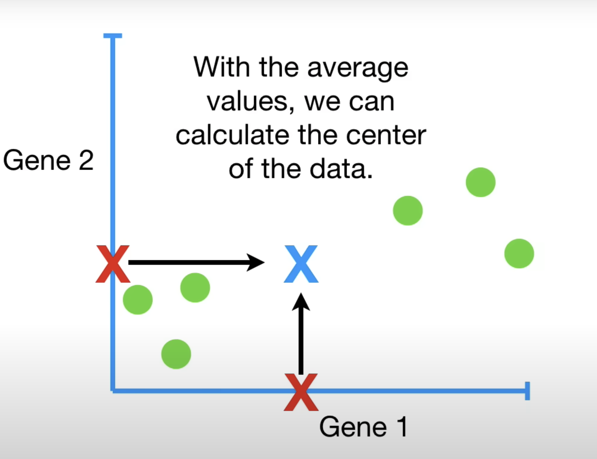 
Centrage des données : on soustrait la moyenne à chaque valeur, ce qui revient à recentrer les données autour de l'origine
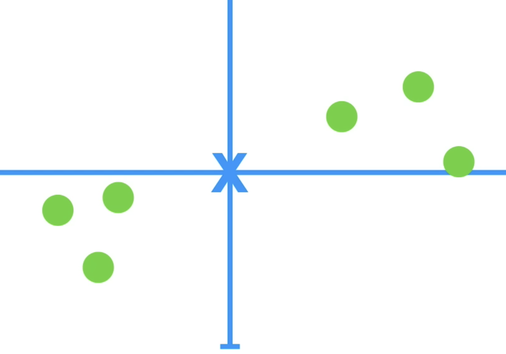 
Recherche de la direction (droite ou vecteur) qui s’ajuste le mieux aux données pour y projeter les points.
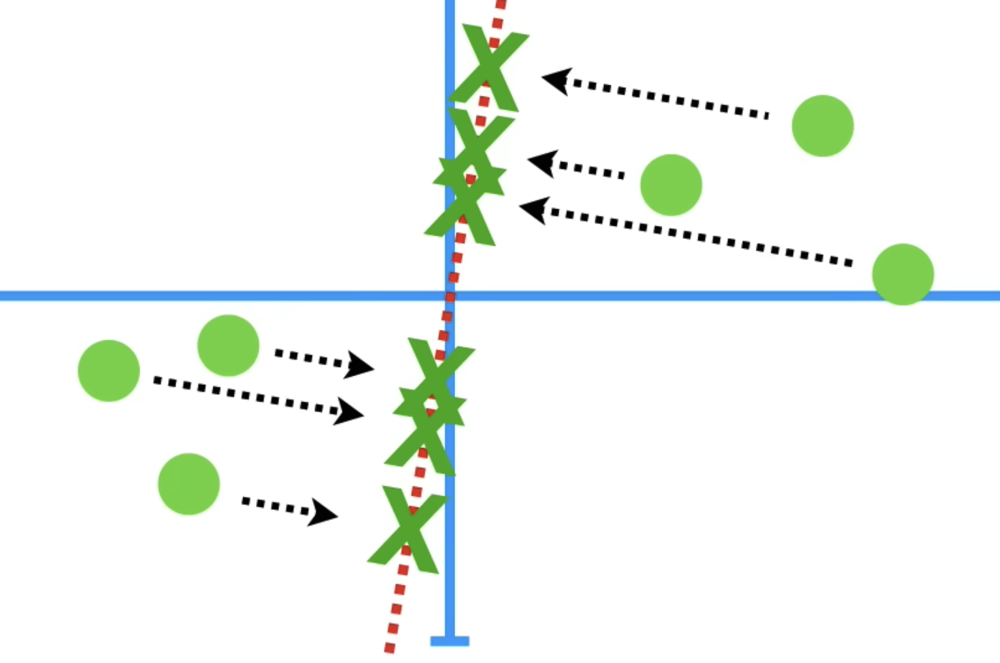 
Étant donné que **a** (distance de la projection à l'origine) est fixe, on peut :

soit minimiser **b** (la distance entre les points et leur projection sur la droite),

soit maximiser **c** (la variance projetée sur la droite)

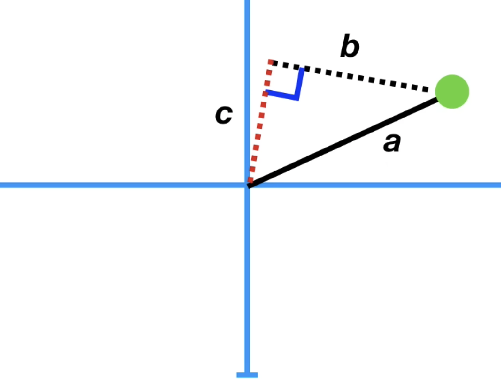
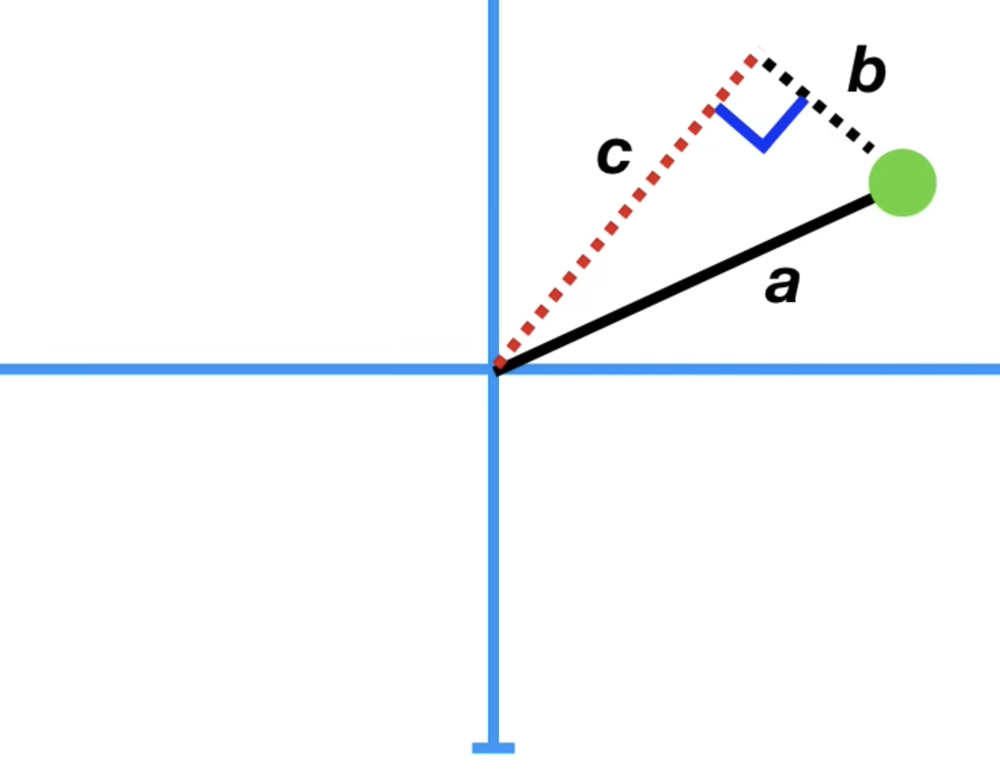

La ligne qui s'ajuste le mieux avec les données est celle qui maximise le total du carré des distances projection/origine

La direction optimale est celle qui maximise la variance projetée (ou, équivalemment, qui minimise la somme des carrés des distances entre les points et leur projection). 
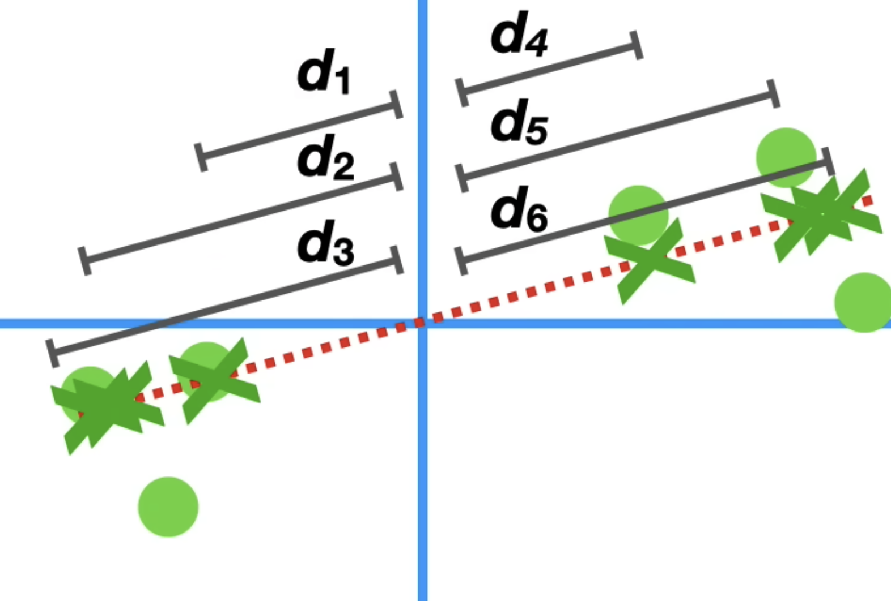 
La direction (ou droite) qui capte le plus de variance possible dans les données est la **première composante principale** (PC1)
Sa pente permet de calculer... 

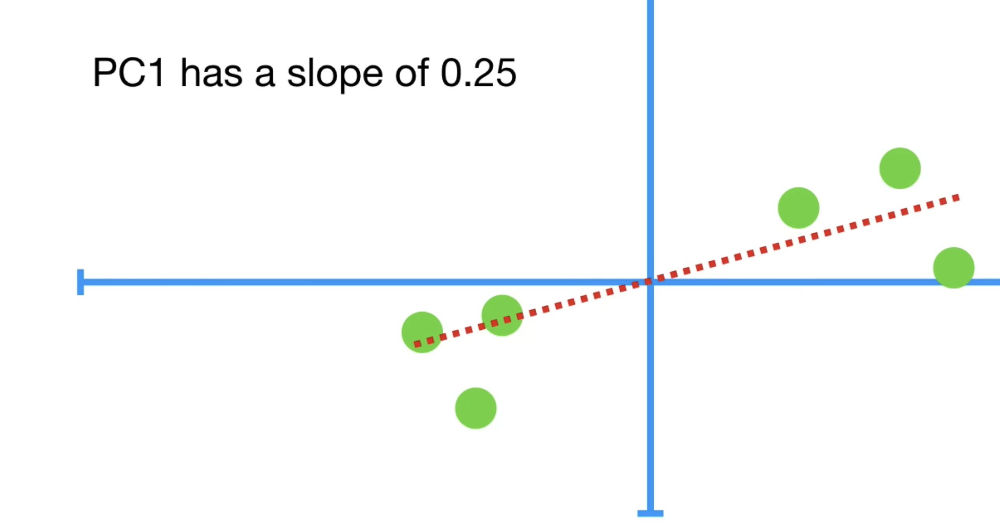
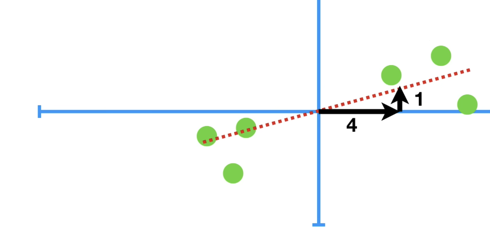

...les scores projetés (nouvelles coordonnées) de chaque individu sur cette composante

  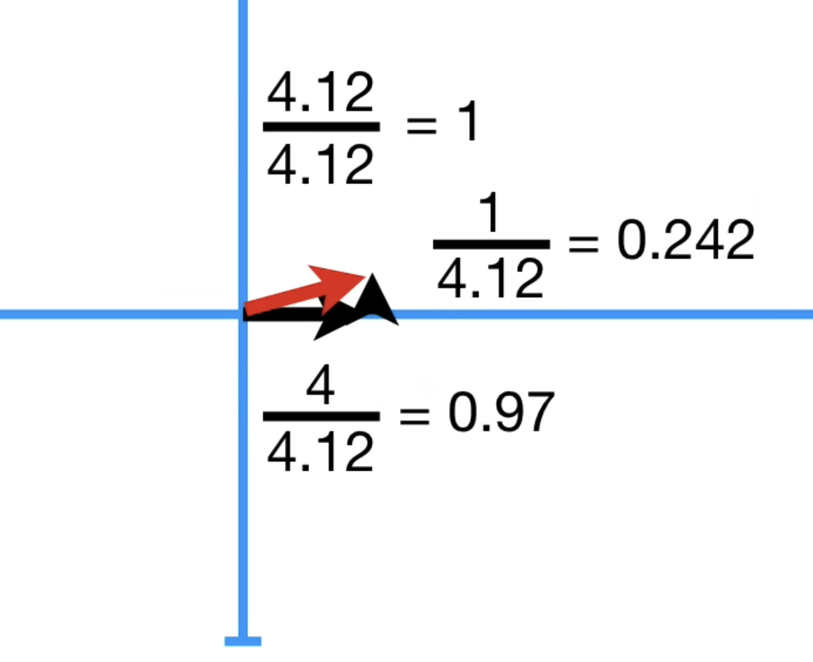
  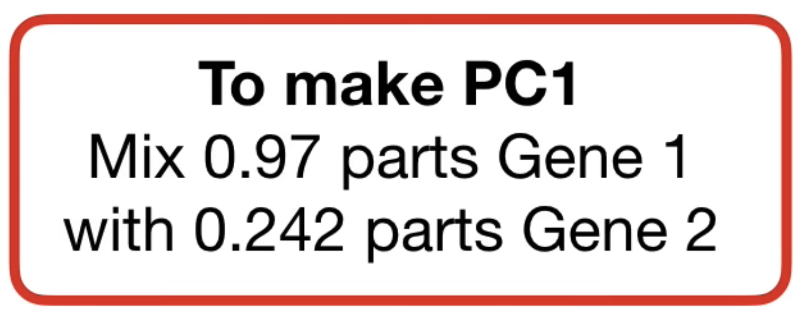

Idem avec la pente de PC2

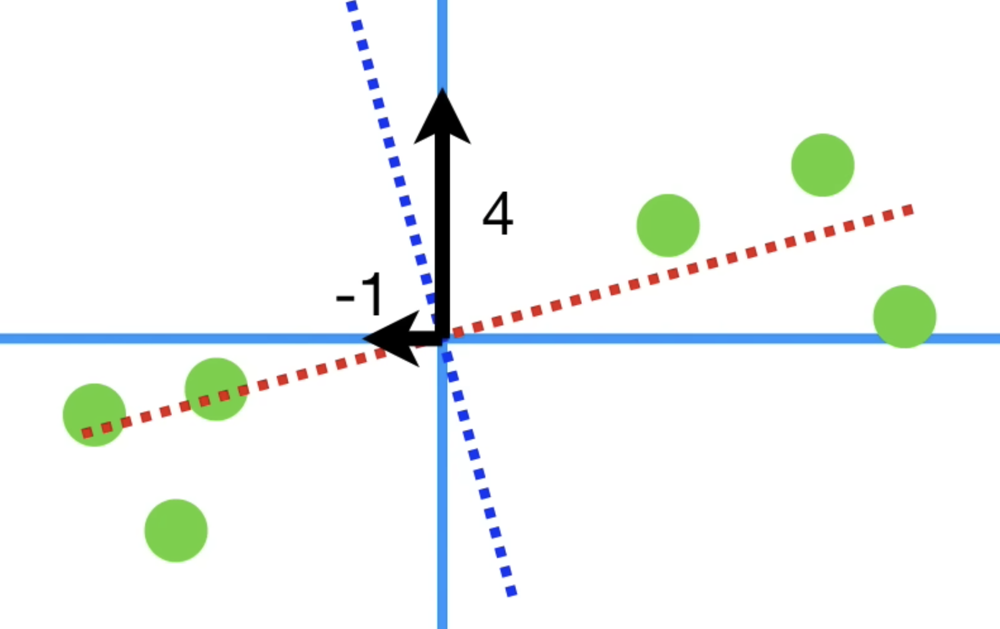
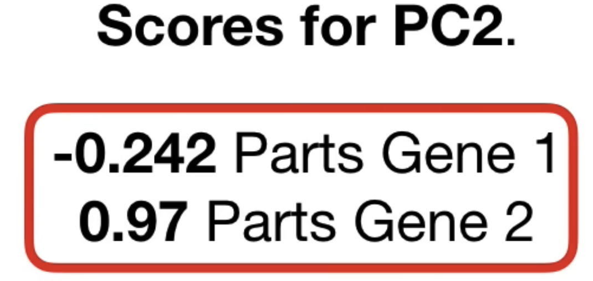

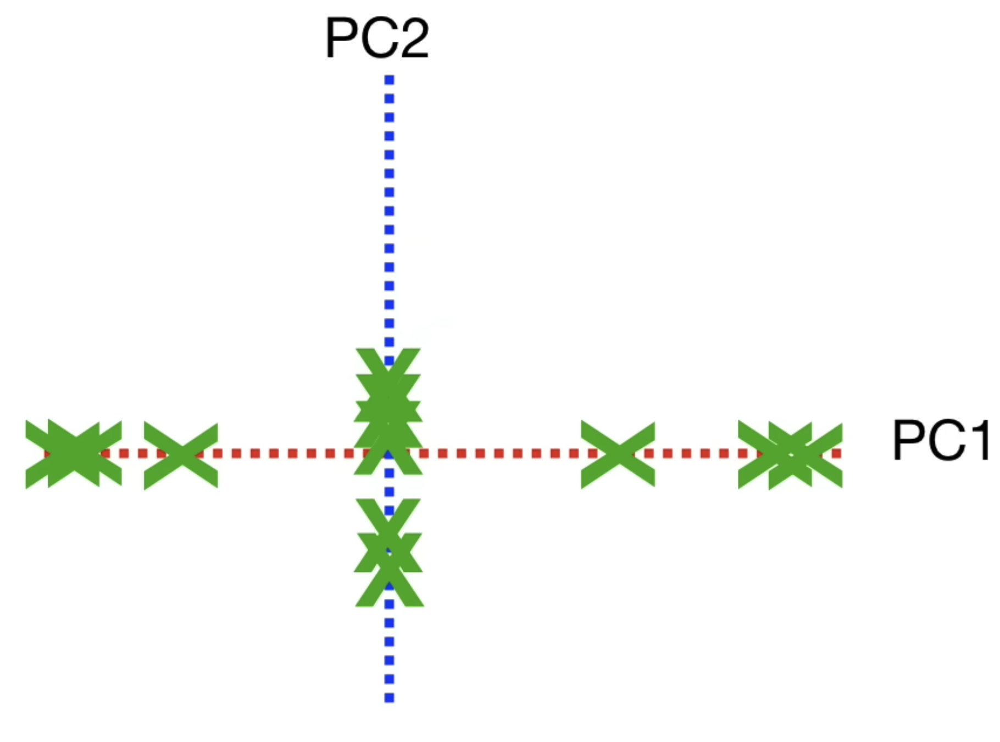 
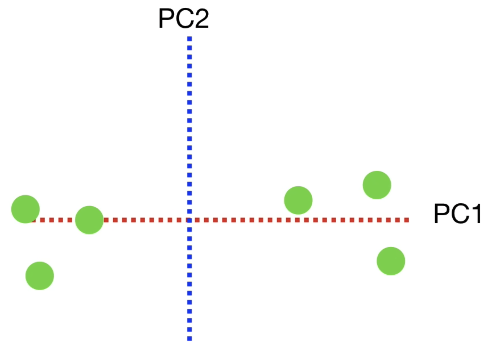 

Pourcentage de variance expliquée par PC1 :
Il s’agit du rapport entre la variance projetée sur PC1 et la variance totale des données.

Cela permet de mesurer l’importance de cette composante dans la représentation des données.
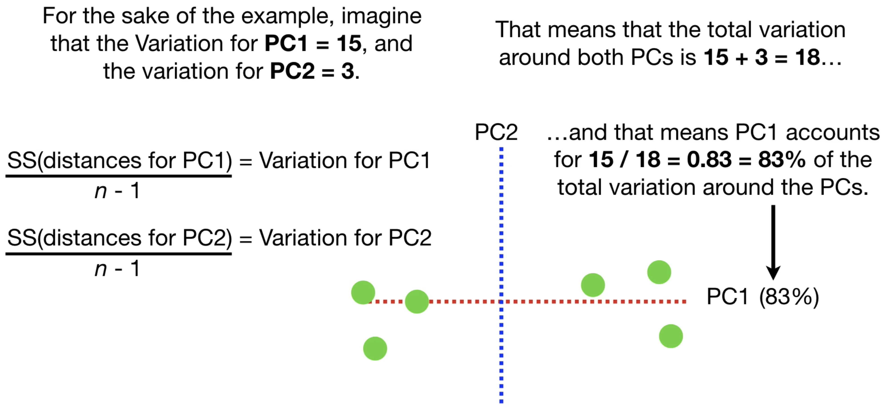 
Variation for PC1 = 15
Variation for PC1 = 3
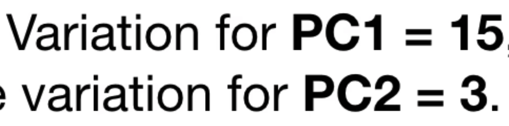 
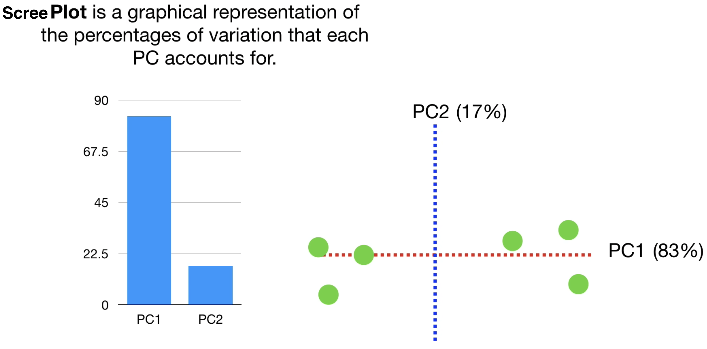 
